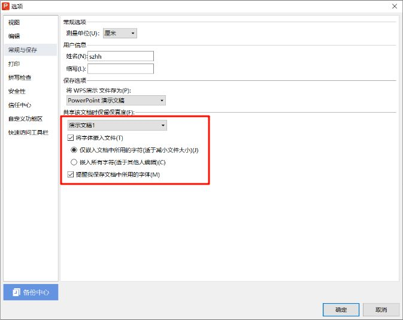

## 宣发PPT必须包含的内容
- 刊物名称
- 核心卖点展示
- 刊物内页展示
- 刊物定价
- 在页面的左上角/右上角展示**荆棘鸟文学社LOGO**

::: info 文学社公开资源（荆棘鸟文学社LOGO可以在此下载）
[附录：文学社公开资源](../reference/Appendix/resource.md)
:::

## PPT中需要注意的细节
### 文字
- 介绍核心卖点的文字需要简洁有力，不可过于冗长
- 介绍刊物内容的文字不宜过长或晦涩难懂，用简单易懂的语言将内容概括出来即可

### 动画

::: warning 切忌滥用动画
PPT软件中一些动画的时长非常长，在实际播放时会拖慢展示节奏

建议多使用淡入/淡出一类简单的动画即可
:::

### 规范用词

::: warning 请使用刊物全名
在宣传PPT中**切忌使用刊物简称**
:::

::: warning 定价请注明单位
刊物定价部分请注明单位**元、角、分**，切忌使用其他简写代替人民币单位
:::

## 保存PPT时的注意事项
### 内嵌字体
当我们在PPT中使用了非系统预装字体时，必须将字体嵌入PPT，才能保证字体在所有的设备上都能正常显示。

#### WPS
1. 点击左上角的**文件->选项**
2. 在左侧的菜单栏中选择**常规与保存**，勾选**将字体嵌入文件（仅嵌入文档中所用的字符）**
#### Microsoft Office
1. 点击左上角的**文件**
2. 点击左下角的**选项**
3. 点击左侧菜单栏中的**保存**，勾选**将字体嵌入文件（仅嵌入演示文稿中使用的字符）**