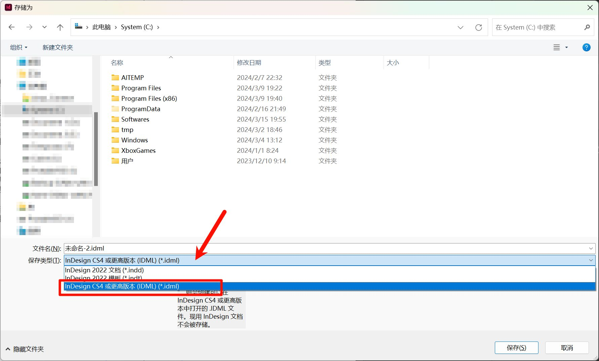
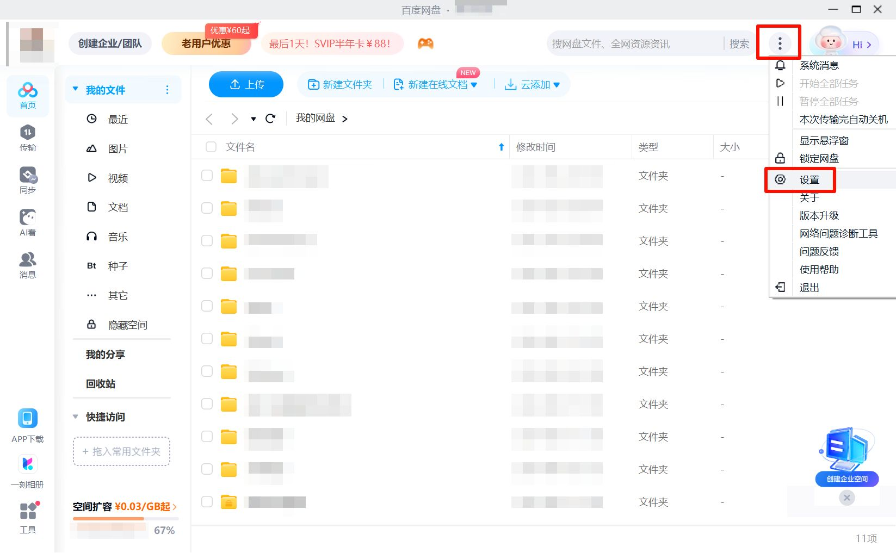
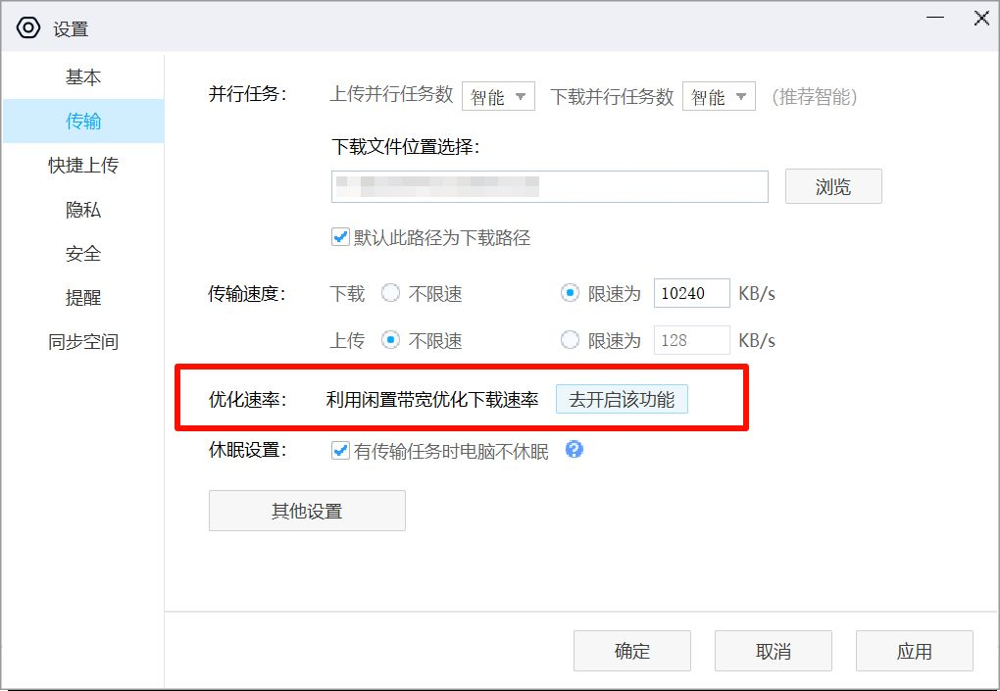
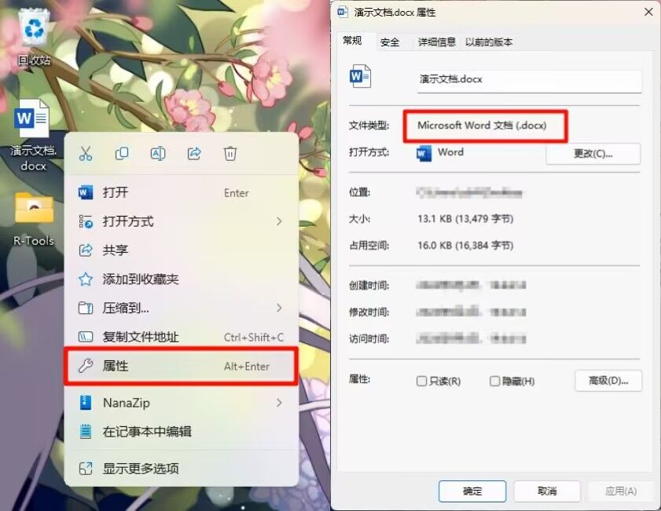
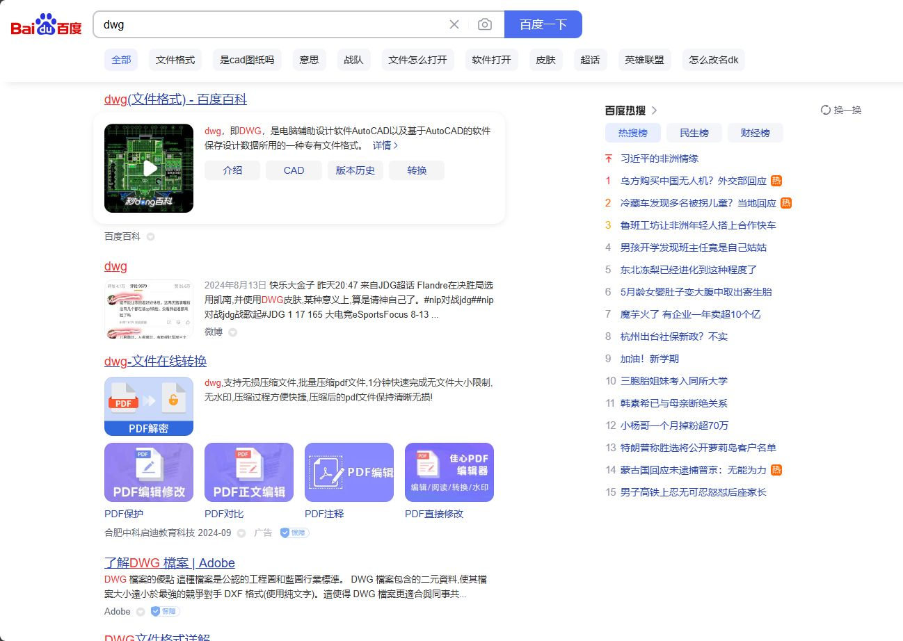

## 高版本文档向下兼容
将 InDesign 文档存储为 IDML 格式可以实现**在低版本中打开高版本文档**：
1. 点击上方菜单栏中 文件->存储为
2. 在**保存类型**中选择 **InDesign CS4 或更高版本(IDML)**
3. 点击保存按钮进行保存
4. 在低版本的 InDesign 中直接打开方才保存的 IDML 文件即可

::: warning IDML 仅作为备选方案
存储为 IDML 格式仅作为一种向低版本兼容的解决方法，正常使用时请将文件保存为 **Indd 格式**
:::

## 图片的清晰度

在排版时我们经常会有这样的疑问：”这张图片到底清不清晰，印刷出来会不会糊呢？”这些问题看似并不复杂，但实际上能够影响一张图片输出质量的因素非常多。我们必须注意每个可能影响图片质量的环节，以避免印刷后出现糊图图的情况。

### 可能影响图片清晰度的环节
一定会影响图片清晰度：
- 原始图片分辨率：原始素材的**有效分辨率**不足（详见：[4.2 图片的基本属性](../ChapterNo4/4.2.md#图片的基本属性)）
- 图片格式转换：将图片转换为**有损**图片格式（详见：[4.2 图片格式转换](../ChapterNo4/4.2.md#图片格式转换)）
- 图片编辑软件导出图片：导出时设置的分辨率**低于原图分辨率**或使用了**有损**图片格式
- 使用 QQ 直接传输图片：图片不以**文件**的形式发送时，QQ 会隐式地将需要传输的图片转为 `jpg` 格式
- InDesign 导出 PDF：以默认设置导出 PDF 会压缩图片分辨率（详见：[3.4 导出 PDF](../ChapterNo3/3.4.md#导出)）

不会影响图片清晰度：
- InDesign 中预览状态下图片不清晰

### 如何快速判断一张图片是否清晰
- 直接查看图片分辨率
	- 理论上像素大于200万图片就比较清晰了
- 放大图片
查看图片分辨率的方法并不总是有效，因为在网络上会出现伪高分辨率的图片，放大以后依然是非常糊的。所以这里建议将以上两种方法**结合**起来使用

### 超分辨率
利用 AI 技术，我们可以通过算法增加图片的清晰度。

::: warning
如果不是真的找不到合适的图片作为素材，**非常不建议**使用超分辨率技术提升图片分辨率（尤其是实拍的照片）。
:::

使用超分辨率技术大致有两种途径：
- 在线网站：能满足一般需求，但存在诸如*图片大小*、*每日转换张数*等限制
- 本地转换：几乎不存在限制。对电脑配置有较高的要求，一些软件也可以在低配置电脑上运行，但运行时间会很长

#### 在线网站
免费的 AI 图片超分辨率网站：
- [iloveimg](https://www.iloveimg.com/zh-cn/upscale-image)：免费 AI 图像提升工具
- [bigjpg](https://bigjpg.com/zh)：AI人工智能图片放大
- [Aiseesoft](https://zh-cn.aiseesoft.com/image-upscaler/)：全功能 AI 图像放大器，一键提高图像分辨率
- [waifu2x](https://waifu2x.udp.jp/index.zh-CN.html)：使用卷积神经网络对动漫风格的图片进行放大操作

#### 本地工具
免费的 AI 图片超分辨率工具：
- [Upscayl](https://upscayl.org/)（推荐）：免费且开源的 AI 图片超分辨率工具。超分辨率效果好且对硬件要求低
    - 

- [waifu2x-coffee](https://github.com/lltcggie/waifu2x-caffe)：waifu2x 的本地图形化版本
    - 

- [Waifu2x-Extension-GUI](https://github.com/AaronFeng753/Waifu2x-Extension-GUI)（主要功能免费）：利用深度卷积神经网络实现图像、GIF 和视频超分辨率以及视频帧插帧
    - 

付费的 AI 图片超分辨率工具：
- [Topaz Photo AI](https://www.topazlabs.com/topaz-photo-ai)

## 使用 QQ 传输文件

QQ 是我们经常会用来传输图片和文件的软件之一，但是很多时候我们会遇到诸如*传到电脑上的图片找不到了*、*图片传过来变糊了*等情况。

### 电脑端接收的文件保存位置
> 星号 * 为通配符，表示任意数字
- 传统 QQ 版本（版本号<=9.7.* ）：文件默认保存在 `C:\Users\你的用户名\Documents\Tencent Files\QQ号\FileRecv` 内
- NT 架构 QQ（版本号>=9.9）：文件默认保存在 `C:\Users\你的用户名\Downloads` 内

::: tip 更改保存位置
在 QQ 的设置中可以更改接收文件的保存位置
:::

### 图片传输
- 从*电脑*发送到*手机*：所有图片默认以**文件**的形式发送
- 从*手机*发送到*电脑*：在图库中选择的图片默认以**图片**形式发送
    - 以直接发送图片时，QQ 会将图片转换为 `jpg` 格式。勾选**原图**选项后 QQ 才会发送原图
    - 以**文件**形式发送图片时，图片质量不受影响
- 使用**我的手机**功能传输的图片会以**文件**形式发送，图片质量不受影响

::: warning 隐式转换
未勾选**原图**选项的图片，QQ 会将其转换为 `jpg` 格式后发送
:::

## Indesign 无法正常启动或启动速度慢
目前已知在 Windows 11 系统下，未连接网络时可能无法正常打开 Indesign 2021 (17.4)。该问题目前无法复现，有待后续排查具体原因。
::: tip 解决方案
连接网络后再打开 Indesign 即可
:::

## 百度网盘桌面端文件下载速度慢
众所周知，各类网盘产品在未开通VIP的情况下，下载速度都会受到限制。百度网盘为了缓解这一问题，在桌面端客户端提供了基于 P2P 原理的加速服务（可以理解为在用户之间传输文件）。在这一服务的帮助下，一些热门资源的下载速度能够得到极大的提高。

1. 打开桌面端百度网盘客户端，点击右上角的“···”打开设置菜单
2. 在菜单中找到**传输**->**优化速率**选项，在选项后点击**去开启该功能**以启用速率优化功能

> 新版本的百度网盘默认开启该功能

## 遇到文件无法正常打开该怎么办
我们在使用电脑的过程中，经常可能遇到无法直接打开的各类文件。接下来的内容将会告诉你，在遇到一个未知的文件时，如何正确地打开这个文件。
### 判断文件后缀名
首先，我们要知道电脑是如何区分文件类型的。或者说，我们要知道电脑是如何帮你使用对应的软件打开文件的。

在计算机中，一个文件通常都具有**后缀名**，**后缀名**就是计算机用来区分文件类型的好帮手。

::: info 文件扩展名
文件扩展名又称**后缀名**
:::

以一个常见的 Word 文档为例，在保存以后，右键该文件，选择**属性**即可查看文件的后缀名。

在文件类型中显示的 **docx** 就是该文件的后缀名，计算机会根据文件的后缀名来确定应该哪个软件来打开它，例如：

| 后缀名  | 使用的软件            | 备注            |
| ---- | ---------------- | ------------- |
| doc  | Word 或 WPS       |               |
| docx | Word 或 WPS       |               |
| ppt  | PowerPoint 或 WPS |               |
| pptx | PowerPoint 或 WPS |               |
| indd | Adobe InDesign   | InDesign 文档   |
| indt | Adobe InDesign   | InDesign 模板文件 |
| txt  | 记事本或其他的文本编辑软件    | 纯文本文件         |

在平时使用计算机时，我们可以多多留意文件的后缀名，这样有助于我们在遇到未知文件的时候判断它应该使用什么软件打开。
### （可选）在网络上搜寻需要的软件
::: info 以扩展名 dwg 为例
我们可以在网络上直接以后缀名为关键词进行搜索相关信息
:::

排除上方的广告后，我们可以判断出 `dwg` 文件应当使用软件 AutoCAD 或其他支持的软件进行打开。

### 为特定的文件类型绑定默认打开方式
通常情况下，我们并不需要手动为文件指定默认的打开方式（即使用什么软件来打开它）。但在一些特殊情况下，文件的默认打开方式可能被更改或失效，此时我们就需要手动为文件绑定默认打开方式。绑定默认打开方式后，我们下一次打开该类型的文件时，只需要**双击该文件即可**。

1. 右键需要打开的文件，选择**打开方式**
2. 在出现的应用列表中，**单击选择**需要使用的软件
3. 点击**始终**即可为该类型的文件绑定打开方式

