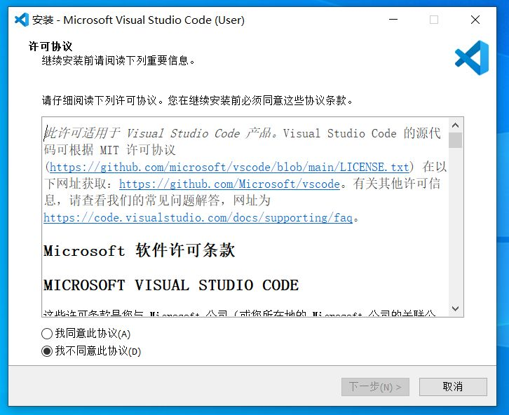
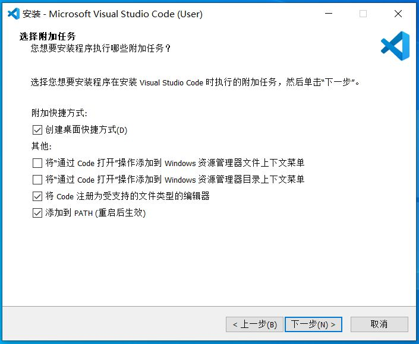

# vscode 简介
vscode 是一款轻量但非常强大的开源代码编辑软件。它可以运行在各个桌面平台上（Windows, macOS, Linux）。它拥有内置的`Javascript`、`Typescript`和`Node.js`支持，并且拥有一个可用于其他编程语言和运行时的丰富插件生态系统。

> Visual Studio Code is a lightweight but powerful source code editor which runs on your desktop and is available for Windows, macOS and Linux. It comes with built-in support for JavaScript, TypeScript and Node.js and has a rich ecosystem of extensions for other languages and runtimes (such as C++, C#, Java, Python, PHP, Go, .NET). 

尽管 vscode 是一款为代码编辑设计的软件，但它强大的编辑功能（比如多行编辑，标点匹配提示等）让它也可以用于纯文本的编辑。

##  安装vscode

### 下载vscode
1. 打开 [vscode官网](https://code.visualstudio.com/#alt-downloads)
2. 选择与你所使用的系统对应的安装包进行下载（附录中给出了[系统名称中英文对照表](###系统名称中英文对照表)）
3. 等待下载完成后打开安装程序
4. 勾选**我同意此协议**并点击下一步
5. 根据需要选择是否**创建桌面快捷方式**（其他选项默认即可），并点击下一步
6. 点击**安装**按钮，等待安装程序完成安装即可

### 配置vscode
vscode 默认使用英文作为界面语言，在联网状态下初次打开 vscode 时会弹出提示框提示安装中文语言包。点击提示框中的 **安装并重启(Install and restart)** 按钮，等待 vscode 下载语言包并重启即可。

## 常用功能

### 多行编辑
- 按住`鼠标中键`并拖动可以选中多行同时进行编辑
- 按住`alt`键，并使用*鼠标左键*点击可以创建多个光标

### 查找和替换
按下快捷键`Ctrl+F`可以打开**查找和替换**窗口

## 附录

### 系统名称中英文对照表
| 系统名称 | 英文原文         | 中文翻译       | 解释                                                 |
| -------- | ---------------- | -------------- | ---------------------------------------------------- |
| Windows  | User Installer   | 单用户安装程序 | 本安装程序仅会为当前用户安装 vscode 软件             |
|          | System Installer | 系统级安装程序 | 本安装程序会为所有用户安装 vscode 软件               |
|          | .zip             | 压缩包         | 无安装程序，解压后即可使用（通常用于制作便携版软件） |
|          | CLI              | 命令行         | 命令行版                                             |
| Linux    | .deb             | -              | 用于 Debian 和 Ubuntu 系统的安装程序                 |
|          | .rpm             | -              | 用于 Red Hat, Fedora, SUSE 系统的安装程序            |
|          | .tar.gz          | 压缩包         | 无安装程序，解压后即可使用                           |
|          | Snap             | -              | Snap 商店软件包                                      |
|          | CLI              | -              | -                                                    |
| Mac      | Apple silicon    | 苹果芯片组     | -                                                    |
|          | Intel chip       | 英特尔芯片组   | -                                                    |
| 其他     | x64              | -              | 64位系统安装包                                       |
|          | x86              | -              | 32位系统安装包                                       |
|          | Arm64            | -              | 64位arm架构系统安装包                                                     |
