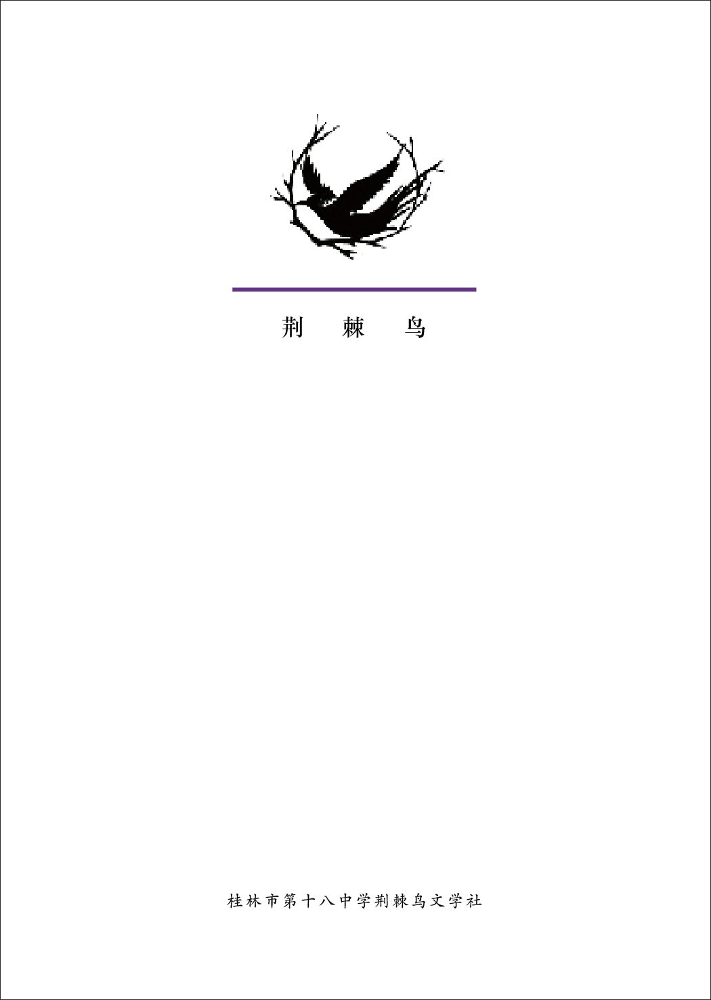

::: info 本页规范仅适用于正刊/文刊
高三特刊规范见 [1.1 高三特刊规格](../../spbook/Cpt1/1.1.md)
:::
## 刊物规格
- 宽：210mm
- 高：285mm
- 边距
    - 上：20mm
    - 下：25mm
    - 左：20mm
    - 右：20mm

## 正文第一字体
- 字体系列：方正书宋简体
- 字重：Regular
- 文字大小：9pt（小五）
- 行间距：15.5点

## 正文第二字体
- 字体系列：方正楷体简体
- 字重：Regular
- 文字大小：9pt（小五）
- 行间距：15.5点

## 注释
- 字体系列：方正书宋简体
- 字重：Regular
- 文字大小：7pt
- 行间距：无
- 位置要求：置于图片上方/下方时注释距离图片2.5mm，注释文本左对齐或者右对齐图片左/右边框。

## 分栏
- 双栏栏间距：8mm

## 内容/版式规定

### 扉页（必须）
扉页用于展示荆棘鸟文学社LOGO和社名。

### 目录（必须）
目录页数固定为**两面**且为**跨页**。

目录条目均采用以下格式
- 文章名称+“/”+撰稿人笔名
- 示例：威远故事 / Chen-pai 白尘

目录条目页码均采用以下格式
- 阿拉伯数字“0”的个数以本次刊物最大页数的位数决定
- 实际页码位数不够时使用“0”占位
- 示例1（总页数一百七十页，文章起始页码第十六页）：016
- 示例2（总页数七十二页，文章起始页码第八页）：08

### 小说
小说采用封图+文章的结构。  
小说开头为全页封图，封图大小为页面大小减去页边距（即 InDesign 中页面的蓝色框以内）。最长/最好/体现刊物中心主题的一篇（该文章由编辑部选出）建议采用跨页封图。  
封图必须根据文章内容选择和制作，封图上必须包含文章标题、美编和作者信息。  
第二页及以后为文章内容。  
小说有多个章节/小标题的，章节序号/小标题占用正文的两行空间，建议使用单独的文本框架。

### 诗歌
诗歌默认采用单页排版。  
版面可以灵活处理。  

### 闲谈/评论
灵活排版，但要保证标题清晰可见。  

## 页码编排
- 以**目录结束后的第一页**作为整本刊物的第一页
- 原则上整书页码按照自然数从小到大进行编排
- **分隔页**可不展示页码；页码**特别影响排版美观的**可不展示页码
- 页码下有背景图片的，请根据图片颜色调整页码颜色