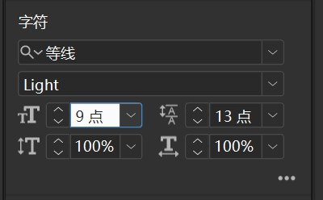
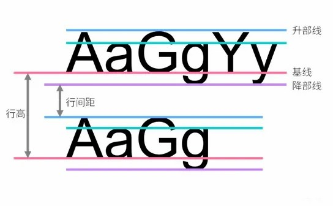
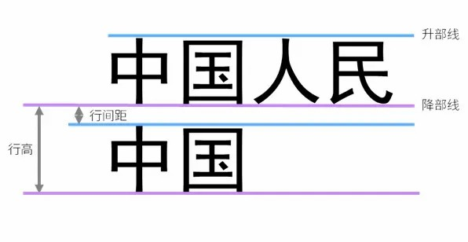
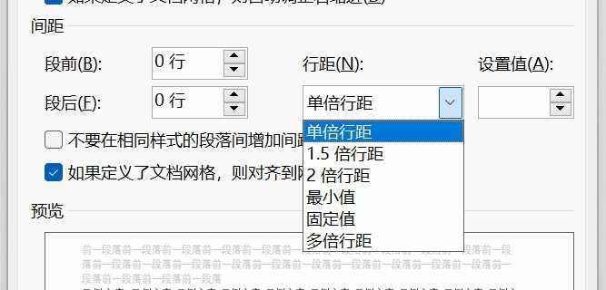

## 字体系列
字体系列的一种通俗叫法是**字体名称**。采用**字体系列**这一称呼是因为一种字体可能拥有多种字重。例如北大方正的*方正悠宋*字体就拥有一系列的字重。

所以使用**字体系列**的称呼会更为准确。

## 文字字重
字重就是指字体**笔画的粗细**，而 Light、Regular(Normal)、Heavy 等表明了字体粗细的程度。

## 文字大小
现行的计算机标准中有多种描述文字大小的方式：如**一号**、**9点**、**10镑**等。

### 点数制（磅数制）
通常写法为 Pt（不同于像素单位Px），俗称“磅”。Pt既不是公制也不是英制，是*印刷中专用的尺度*。

> 1点（1磅）= 0.35146mm 1点（1磅）= 1/72英寸。

### 号数制
- 主要号数：初号、一号、二号、三号、四号、五号、六号、七号。  
- 另加号数：小初、小一、小二、小三、小四、小五、小六、小七。  

总共16个字号。通常在 Microsoft Word 中使用。

### 号数制和点数制对应表

| 字号 | 磅数 | 
| ---- | ---- |
| 初号 | 42   |
| 小初 | 36   |
| 一号 | 26   |
| 小一 | 24   |
| 二号 | 22   |
| 小二 | 18   |
| 三号 | 16   |
| 小三 | 15   |
| 四号 | 14   |
| 小四 | 12   |
| 五号 | 10.5 |
| 小五 | 9    |
| 六号 | 7.5  |
::: info InDesign 中使用的是磅数制

:::

## 全角和半角

> 因汉字是方块字，假名也是方块字，考虑印刷上工整性，遂让标点符号也占一个汉字的位置。日本在信息化之时，照搬印刷上的设置，增加了一套全角的 ASCII 码、一套半角的片假名，这就是全角和半角的由来。

::: tip 全角和半角切换
通常输入法切换全/半角的快捷键是 `shift+space(空格)`
:::

最佳实践：
- 在进行**中文处理**时，汉字和标点符号使用全角，字母、其它符号和数字使用半角。
- 在进行**英文处理**时，如：英文输入、编写程序、电子邮件地址、网站链接等，使用半角。

::: info 段首空格必须使用全角空格
在进行中文排版时，段首空格必须使用**全角空格**。

使用全角空格时，我们只需要按下两次空格键即可完成一次段首缩进（空两格）
:::

## 行间距
在日常生活中，我们可能不会过多地关注行间距的影响，但是在排版中，行间距是非常重要的。一些研究表明，合适的行间距可以让人们的阅读更加顺畅，提高阅读效率。

文学社的刊物正文均规定了行间距，详见 [1.1 荆棘鸟文学社刊物规格](../ChapterNo1/1.1.md)

以下内容有兴趣的可以了解，在实际排版中基本不会涉及。

中文字体中：
- **行间距**指一行中文的**降线部**与下行中文**升线部**之间的距离。
- **行高**指一行中文的**降线部**与下行中文**降线部**之间的距离。

在 Microsoft Word 中：
行间距有单位行距、1.5位行距、双倍行距、固定值、多倍行距

