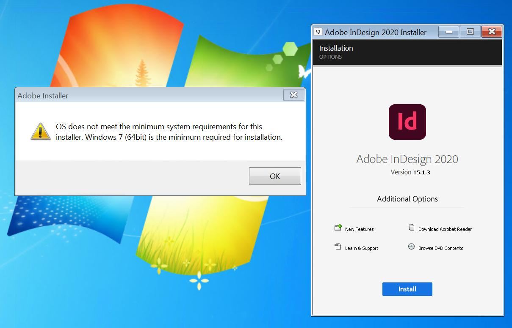
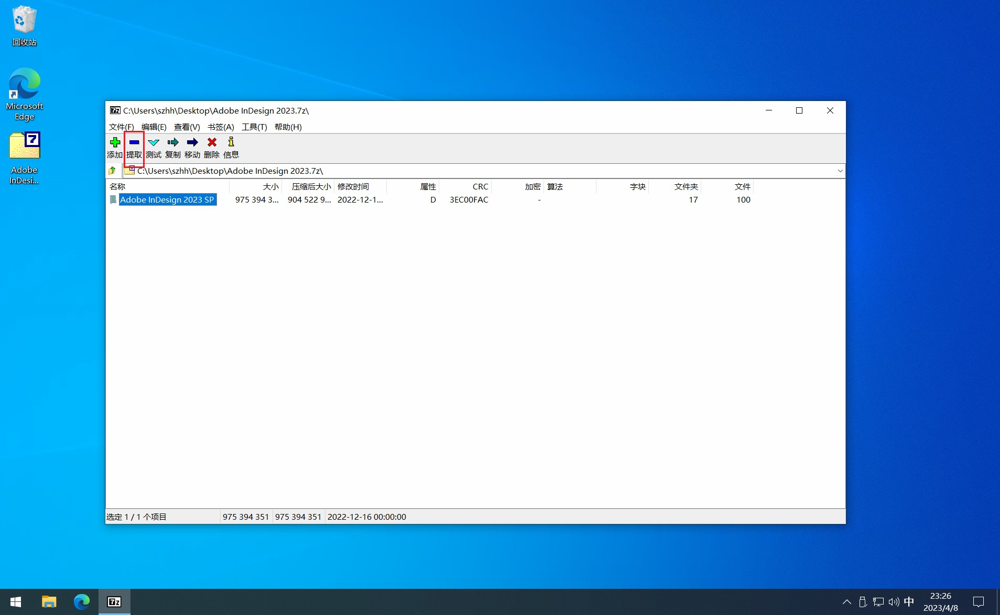
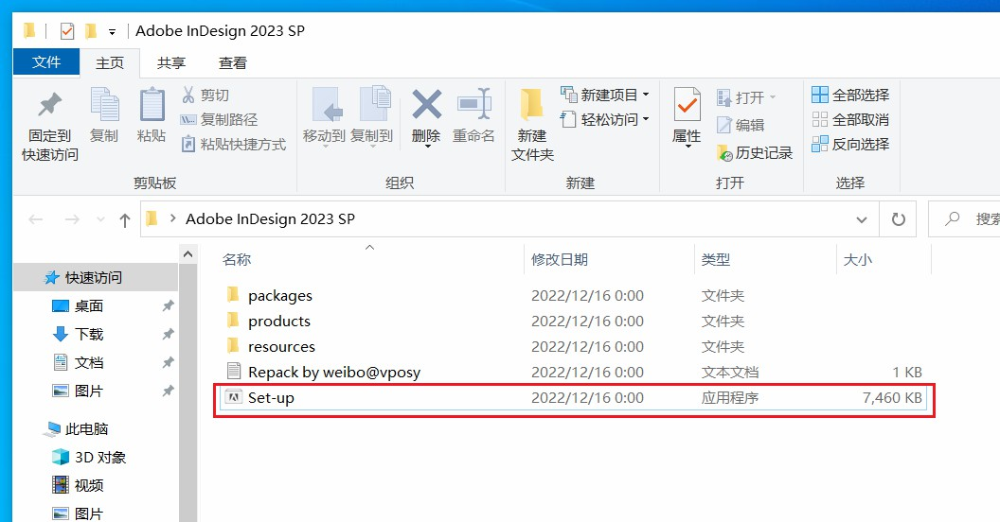
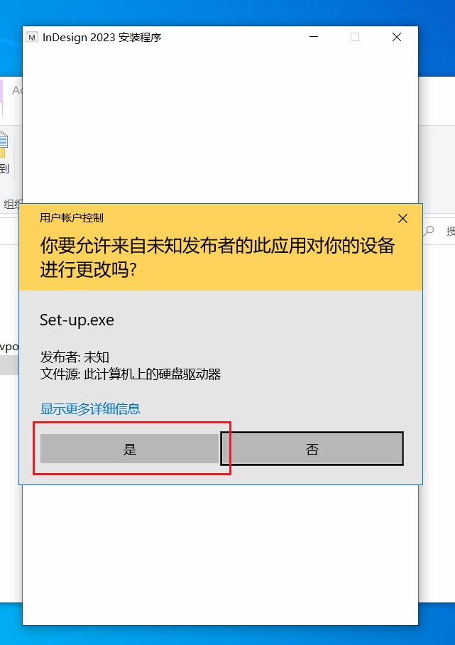
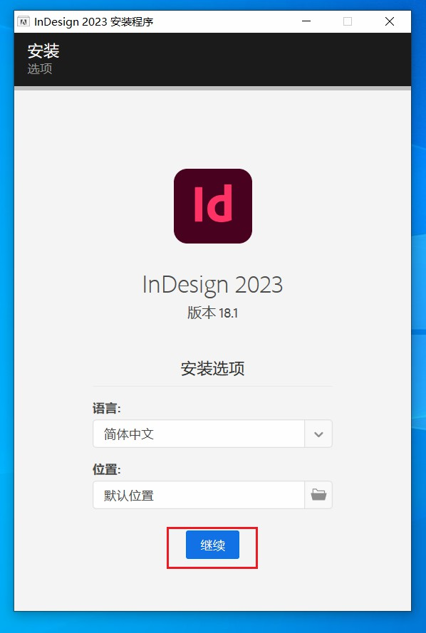
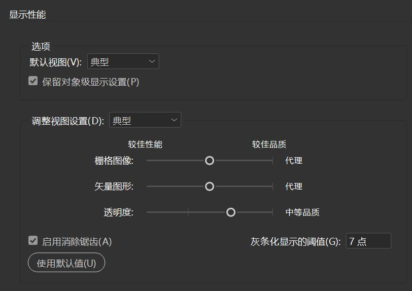
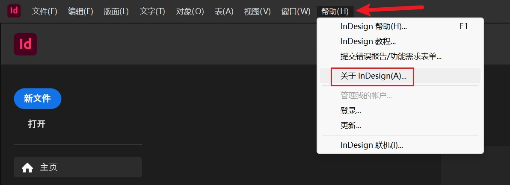
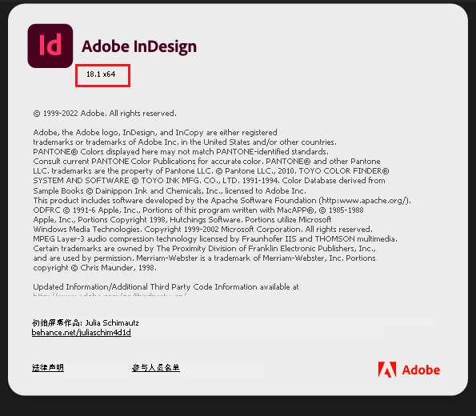

本节介绍 Adobe InDesign 软件的安装和配置步骤。

## InDesign 系统要求
::: tabs
@tab InDesign 2021 (16.x)
|硬件|最低需求|
|---|---|
|处理器|Intel 多核处理器（具有 64 位支持）或 AMD Athlon® 64 处理器|
|操作系统|Windows 10（64 位）在 Windows 10 版本 1607、1809、1903、1909、2004、20H2、21H1 上受支持。|
|内存|最少 4 GB 内存（建议 16 GB）|
|硬盘空间|安装需要 3.6 GB 可用硬盘空间（不能在可移动设备上安装）|

@tab:active InDesign 2022 (17.x)
|硬件|最低需求|
|---|---|
|处理器|Intel 多核处理器（具有 64 位支持）或 AMD Athlon® 64 处理器|
|操作系统|Windows 10 64 位（版本 1909）或更高版本；不支持 LTSC 版本。在 Windows 10 版本 1909、2004、20H2、21H1、21H2 上受支持。|
|内存|最少 4 GB 内存（建议 16 GB）|
|硬盘空间|安装需要 3.6 GB 可用硬盘空间（不能在可移动设备上安装）|

@tab InDesign 2023 (18.x)
|硬件|最低需求|
|---|---|
|处理器|Intel 多核处理器（具有 64 位支持）或 AMD Athlon® 64 处理器|
|操作系统| Windows 10（64 位） Windows 11（64 位）在 Windows 10 版本 20H2、21H1、21H2 和 Windows 11 版本 21H2 上受支持。|
|内存|最少 8 GB 内存（建议 16 GB）|
|硬盘|安装需要 3.6 GB 可用硬盘空间（不能在可移动设备上安装）|
:::

::: tip InDesign 已经停止对 Windows 7 系统的支持
最后一个支持在 Windows 7 (64bit) 系统上运行的 InDesign 软件版本为 Adobe InDesign 2020 v15.1.3

:::

## InDesign 软件下载

::: warning 软件版本
所有社员使用的软件版本**必须统一**，如不统一会导致汇总合并时出现文件无法打开的情况。
> 推荐使用 **InDesign 2022 17.4** 版本（该版本仅支持 Windows 10 及以上的系统）
:::

### （推荐从这里下载）微博 @vposy 制作的一键安装包
- 链接：[点击跳转百度网盘](https://pan.baidu.com/s/1lFZu1uKfeP7yyV3YaI8b9Q?pwd=pht2)
- 提取码：pht2
- 解压密码：@vposy

> [附录：常见问题——“百度网盘桌面端文件下载速度慢”的解决方法](../Appendix/question.md#百度网盘桌面端文件下载速度慢)

> 其他下载途径（需要科学上网）
> - [Adobe Apps Patching](https://genpguides.github.io/)：Adobe 应用程序补丁集合（包含了以下两种补丁的安装指引）
>   - ~~[Monkrus Webside](https://w14.monkrus.ws/)~~（该网站已无法访问）：Monkrus Patching
>   - [GenP](https://www.reddit.com/r/GenP/)：GenP Patching

## 安装 InDesign
::: info 安装前准备
- 下载 InDesign 安装包
- 安装 [7zip](https://www.7-zip.org/) 或其他压缩软件
- 预留约 2G 的空间用于解压
:::

1. 打开含有 InDesign 软件的压缩包，**提取**（解压）到已预留的空间内。
2. 双击解压出的文件中的 **Set-up**（Set-up.exe）文件，并同意管理员权限申请。 
3. 点击**继续**按钮，开始安装 InDesign。
4. 等待进度条完成即安装完成

## InDesign 软件配置
点击菜单栏中的**编辑->首选项->常规**，即可打开首选项设置。
### 常规
- 建议关闭**在没有打开文档时显示主屏幕**。
### 界面
- 建议将颜色主题调整为第一个**黑色**，有助于减少灰色对视觉的影响。
- 建议将**选项->手型工具**的滑动条调至中央，并开启**拖动时灰条化矢量图形**。

### 显示性能
- 可以适当调整视图设置以减少软件使用时的卡顿现象。

## InDesign 软件版本
1. 打开 InDesign 软件。
2. 点击上方菜单栏的帮助。
3. 选择“帮助”菜单中的“关于 InDesign 选项”。
4. 在弹出的窗口中会显示软件的版本信息

> 对该版本号的补充说明：
> 
> **18.1** 是当前 InDesign 的版本号
> 
> **x64** 是当前软件的架构，与软件版本无关
> 
> 不同的电脑有不同的架构，通常为 **x86** 或 **x64**，分别对应 **32 位** 和 **64 位**
> 
> 电脑的架构可以在**控制面板**->**系统**中查看
> 
> **64位** 的系统可以运行 **64位** 的软件和 **32位** 的软件；**32位** 的系统只能运行 **32位** 的软件

::: info 高低版本兼容问题
高版本可以读取低版本保存的文件；但高版本的软件保存的文件在低版本的软件中无法正常打开。
> 附录中给出了文件因版本问题无法打开时的解决方法 [常见问题：高版本文档向下兼容](../Appendix/question.md#高版本文档向下兼容)
:::