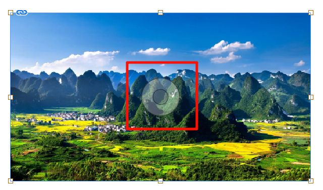

## InDesign 界面

初次打开 InDesign 时，我们会看见如上界面
- 左侧为**工具栏**：编辑文档时使用的所有工具，如“选择工具、文字工具、直线工具”等均可以在这里找到
- 上方为**菜单栏**：菜单栏中提供了各种选项和命令，如“新建文档”“保存文档”等文件操作
- 右侧为**其他面板**：这些面板提供了对文档进行处理的各种操作，在**菜单栏->窗口**菜单中可以打开各种面板

## 创建文档
::: info 荆棘鸟文学社刊物规格
- [美编文档 1.1 节：荆棘鸟文学社刊物规范](../ChapterNo1/1.1.md)

- [高三特刊 1.1 节：高三特刊规格](../../spbook/Cpt1/1.1.md)
:::
1. 点击菜单栏中的**文件->新建->文档**。
2. 在弹出的窗口中更改文档的**长度**和**宽度**，然后点击右下角的**边距和分栏**进入下一步的配置。
3. 在弹出的窗口中修改页边距，栏数和栏间距不需要更改（在新建的文本框中可以单独修改栏数和栏间距）。点击边距一栏中央的链状图标可以开启/关闭边距链接。
4. 点击确定即可完成文档的新建。

::: tip 注意单位
在输入数值时，请留意**数值的单位**，如刊物的长宽通常以**毫米**为计量单位。
:::

## 新建文本框
点击左侧竖排工具栏中的**文字工具**。

在页面中按住并拖动即可创建一个文本框。

::: tip 更多工具

工具栏中一些工具的右下角有一个**小三角**标志，使用**鼠标右键**单击它，就可以看到更多同类工具
:::

## 缩放/移动页面
- **放大/缩小页面**：按住`alt`键，同时滑动鼠标滚轮或使用组合键 `Ctrl`+`+(加号)`或`Ctrl`+`-(减号)`
- **自由移动页面**：在未选择任何内容的情况下，按住 `空格键`，等待光标变成手型后，使用鼠标左键拖动页面
- 上下移动页面：直接滑动鼠标滚轮
- 左右移动页面：按住 `ctrl`，同时滑动鼠标滚轮

## 插入和编辑图片
在 InDesign 文档中插入图片有以下两种方式
- （最常用）直接将图片拖入 InDesign 的文档编辑区，拖入后再按下并拖动鼠标即可将图片调整为合适的大小
- 在上方菜单栏中选择**文件->置入**，选择需要插入的图片，单击**置入**即可

### 框架
在 InDesign 中，图片在插入文档后，InDesign 会将插入的图片放置到一个与图片大小相同的**框架**中。

::: info 对象
框架中的内容称为**对象**
:::

在层级关系上，**框架>对象**。这也就意味着，图片对象的大小如果超出了框架，**超出的部分不会显示**。

- 使用鼠标左键**单击**图片即可选择图片所在的**框架**
- 使用鼠标左键**双击**图片即可选择图片**对象**

在对框架或对象进行操作时，我们需要区分我们选择的是**框架**还是框架内的**对象**。
- 选中**框架**时，选中框为**蓝色**
- 选中**对象**时，选中框为**褐色**

InDesign 提供了一些快速调整框架大小的选项，右键框架并选择**适合**选项即可见到。

常用的有**使框架适合内容**（将框架调整为对象的大小）和**按比例填充框架**（将对象强制调整为框架的大小）

### 移动图片
- 选中**框架**后拖动即可调整**整个框架的位置**
- 选中**对象**后拖动即可调整**对象在框架内的位置**（框架不会移动）

::: tip 快速移动图片对象的位置
当我们将鼠标放置到图片框架上时，框架中央会出现一个**圆形操作柄**，直接拖动它即可调整**对象在框架内**位置。

:::

### 缩放图片
::: warning 等比放大
无特殊情况时，图片必须等比放大
:::

在选中框架的情况下，我们可以将**框架和图片对象一起**等比缩放。

同时按住 `Ctrl` `Shift` 两个键，再使用鼠标拖动框架边缘即可将框架和图片对象一起**等比缩放**。