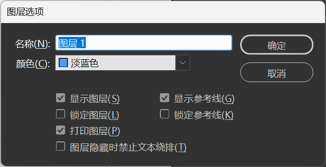

## 创建文档
双击桌面上的 InDesign 图标即可打开 InDesign 软件。
1. 点击菜单栏中的**文件->新建->文档**。
2. 在弹出的窗口中更改文档的**长度**和**宽度**，注意单位与规范统一。然后点击右下角的**边距和分栏**进入下一步的配置。
3. 在弹出的窗口中修改页边距，栏数和栏间距不需要更改（在新建的文本框中可以单独修改栏数和栏间距）。点击边距一栏中央的链状图标可以开启/关闭边距链接。
4. 点击确定即可完成文档的新建。

## 新建文本框
点击左侧竖排工具栏中的**文字工具**。（使用右键点击可以获得更多的选项）

在页面中按住并拖动即可创建一个文本框。

## 串接文本框架
在文字内容过多，文本框区域无法完全显示时，我们可以使用**串接文本框架**来解决这个问题。使用串接的文本框可以在多个文本框内连续排文，这样在框架内选择/修改文本时，可以直接选择多个文本框内的文字，为长文的排版省下很多的时间。

> 以下是 Adobe 官方文档中对串接文本框架的解释和说明：  
> 框架中的文本可独立于其他框架，也可在多个框架之间连续排文。要在多个框架（也称为文本框）之间连续排文，必须先连接这些框架。连接的框架可位于同一页或跨页，也可位于文档的其他页。在框架之间连接文本的过程称为_串接文本_。此过程也称为**链接文本框架**或**链接文本**框。
> 每个文本框架都包含一个**入口**和一个**出口**，这些端口用来与其他文本框架进行连接。空的入口或出口分别表示文章的开头或结尾。端口中的箭头表示该框架链接到另一框架。出口中的红色加号 (+) 表示该文章中有更多要置入的文本，但没有更多的文本框架可放置文本。这些剩余的不可见文本称为**溢流文本**。

创建串接文本框架的步骤：
1. 点击已经溢流的文本框架右下角的**红色加号**。
2. 在想要创建第二个文本框的位置**按住并拖动鼠标后松开**，即可创建串接的文本框。

::: tip
如果需要查看文本框架的串接情况。可以选择软件上方菜单栏中的 **视图->其他->显示文本串接**，然后选中需要查看串接的文本框架即可
:::

## 图层
使用专业的图像、视频编辑工具必须熟悉图层相关的操作。

下面列出图层几个不可替代的作用：
1. 图层可以分离不同的元素，对画面中不同的元素进行分层管理
2. 图层可以很好地处理元素的遮盖关系
3. 不同的图层可以通过算法进行混合以实现特殊的效果

InDesign 的图层面板可以在顶部菜单栏的 **窗口->图层** 中打开。

### 认识图层面板
- 面板中部是各个图层的显示区域
  - 单击**眼睛图标**可以开启和隐藏图层
  - 单击眼睛图标右侧的小块**空白**可以锁定图层
  - 双击图层名可以打开图层选项
- 面板的底部从右到左分别是图层的**删除**和**新建**按钮

::: info 图层全局可用
InDesign 中的图层不独立于每个页面，而是在整个文档中通用。在第一页新建的图层在其他页中依然可见，在主页中也可见。
:::

### 创建和编辑图层
- 点击面板下方的**加号**以添加单个图层
- 选中需要删除的图层再点击面板下方的**垃圾桶**以删除选中的图层
- 双击图层名字可以打开图层选项编辑

	- 名称：图层名称
	- 颜色：更改该图层的颜色标记
	- 其他选项功能如面板中描述  

- 按住并拖动图层可以调整图层或元素的上下顺序
- 点击图层左端的小箭头可以展开当前图层

### 图层面板的其他功能
- 点击图层/元素最右侧的**小方块**可以选择该图层内的所有元素/该元素

### 图层管理
1. 尽量把类似的元素放在同一图层内
2. 图层数量不宜过多，过多的图层反而会给编辑过程带来很多麻烦
3. 图层一定要有清晰的命名

## 页面管理
InDesign 中一个文档由若干个**页面**组成。使用**页面**面板可以对页面和跨页进行排列、复制和重组。

### 页面面板

1. 在 InDesign 上方的菜单栏中选择 **窗口->页面** 打开**页面**面板
2. 点击下方的**加号**可新建页面
3. **按住并拖动**页面可对页面进行排序

### 主页功能

::: warning
注意不要将正文内容放进主页中。主页仅用于添加**重复性**的内容。
:::

主页（又称母版页）类似于一个可以应用在多个页面上的背景。主页上的内容会应用在应用了该主页的页面上。对于重复的内容如徽标、页码、页眉和页脚可以使用该功能进行添加。

1. 双击页面面板上方的一个主页可以进入其编辑页面。主页的编辑页面与正常页面的编辑完全相同
2. 右键页面面板上方区域可以新建主页

3. 右键需要应用主页的页面，选择**将主页应用于页面**，然后选择需要应用的主页即可将主页应用到页面上

::: tip 主页的层级关系
如果要将主页中的对象显示在文档页面上的对象之前，将主页中的对象移动到**更高的图层**即可。
:::
