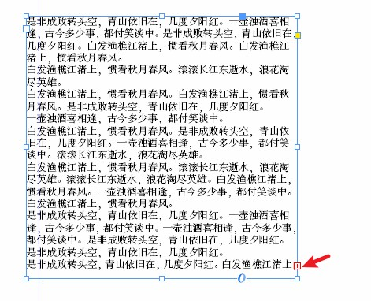
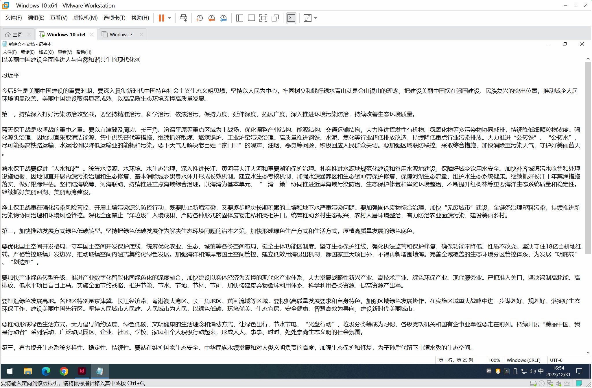
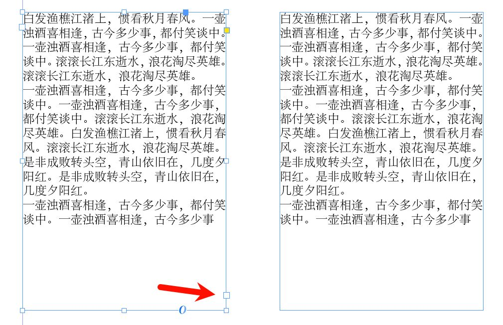
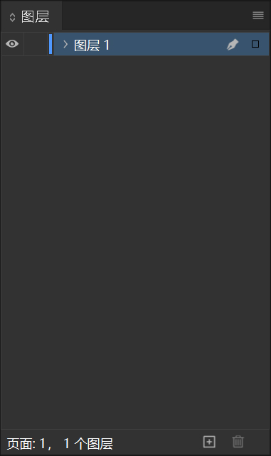
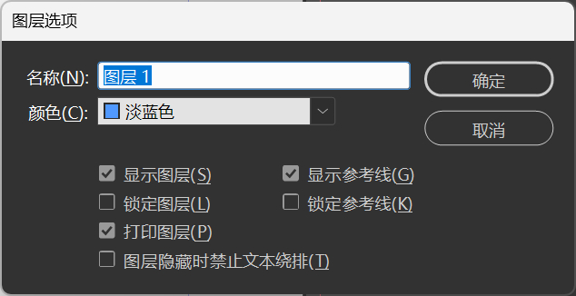
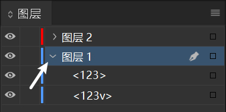
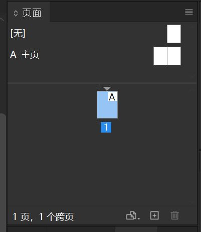
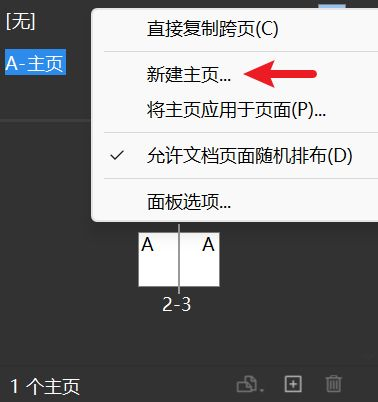
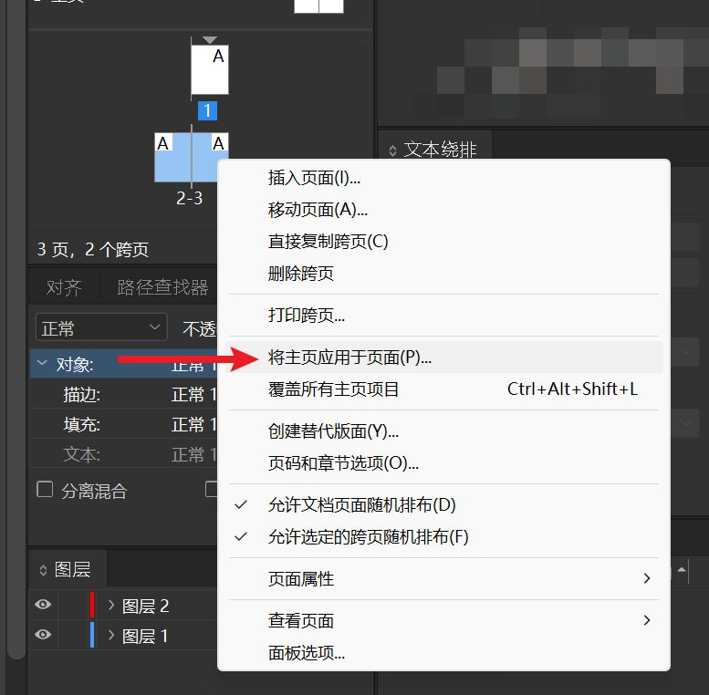

## 串接文本框架

在文字内容过多，文本框区域无法完全显示时，我们可以使用**串接文本框架**来解决这个问题。使用串接的文本框可以在多个文本框内连续排文，这样在框架内选择/修改文本时，可以直接选择多个文本框内的文字，为长文的排版省下很多的时间。

::: danger 注意
同一文本超出文本框区域后**必须使用**串接的文本框架进行排版。
:::

创建串接文本框架的步骤：
1. 点击已经溢流的文本框架右下角的**红色加号**。
2. 在想要创建第二个文本框的位置**按住并拖动鼠标后松开**，即可创建串接的文本框。

::: tip
如果需要查看文本框架的串接情况。可以选择软件上方菜单栏中的 **视图->其他->显示文本串接**，然后选中需要查看的文本框架即可
:::

对于两个（多个）未串接的文本框可以按照以下步骤进行串接：
1. 选中第一个需要串接的文本框
2. 点击文本框右下角的小方块
3. 点击第二个需要串接的文本框即可
4. 重复以上操作即可串接多个文本框

## 图层
使用专业的图像、视频编辑工具必须熟悉图层相关的操作。

下面列出图层几个不可替代的作用：
1. 图层可以分离不同的元素，对画面中不同的元素进行分层管理
2. 图层可以很好地处理元素的遮盖关系
3. 不同的图层可以通过算法进行混合以实现特殊的效果

InDesign 的图层面板可以在顶部菜单栏的 **窗口->图层** 中打开。

### 认识图层面板
- 面板中部是各个图层的显示区域
  - 单击**眼睛图标**可以开启和隐藏图层
  - 单击眼睛图标右侧的小块**空白**可以锁定图层
  - 双击图层名可以打开图层选项
- 面板的底部从右到左分别是图层的**删除**和**新建**按钮

::: info 图层全局可用
InDesign 中的图层不独立于每个页面，而是在整个文档中通用。在第一页新建的图层在其他页中依然可见，在主页中也可见。
:::

### 创建和编辑图层
- 点击面板下方的**加号**以添加单个图层
- 选中需要删除的图层再点击面板下方的**垃圾桶**以删除选中的图层
- 双击图层名字可以打开图层选项编辑

	- 名称：图层名称
	- 颜色：更改该图层的颜色标记
	- 其他选项功能如面板中描述  

- 按住并拖动图层可以调整图层或元素的上下顺序
- 点击图层左端的小箭头可以展开当前图层

### 图层面板的其他功能
- 点击图层/元素最右侧的**小方块**可以选择该图层内的所有元素/该元素

### 图层管理
1. 尽量把类似的元素放在同一图层内
2. 图层数量不宜过多，过多的图层反而会给编辑过程带来很多麻烦
3. 图层一定要有清晰的命名

## 页面管理
InDesign 中一个文档由若干个**页面**组成。使用**页面**面板可以对页面和跨页进行排列、复制和重组。

### 页面面板

1. 在 InDesign 上方的菜单栏中选择 **窗口->页面** 打开**页面**面板
2. 点击下方的**加号**可新建页面
3. **按住并拖动**页面可对页面进行排序

### 主页功能

::: warning
注意不要将正文内容放进主页中。主页仅用于添加**重复性**的内容。
:::

主页（又称母版页）类似于一个可以应用在多个页面上的背景。主页上的内容会应用在应用了该主页的页面上。对于重复的内容如徽标、页码、页眉和页脚可以使用该功能进行添加。

1. 双击页面面板上方的一个主页可以进入其编辑页面。主页的编辑页面与正常页面的编辑完全相同
2. 右键页面面板上方区域可以新建主页

3. 右键需要应用主页的页面，选择**将主页应用于页面**，然后选择需要应用的主页即可将主页应用到页面上

::: tip 主页的层级关系
如果要将主页中的对象显示在文档页面上的对象之前，将主页中的对象移动到**更高的图层**即可。
:::

## InDesign 的文件类型
InDesign 中有三种项目文档格式：
- Indd：以二进制形式存储的项目文档，通常情况下都存储为该格式
- Indt：项目模板，通常不会使用
- IDML：使用 InDesign 标记语言存储的项目，通常用于向下兼容（详见[附录：高版本文档向下兼容](../Appendix/question.md#高版本文档向下兼容)）