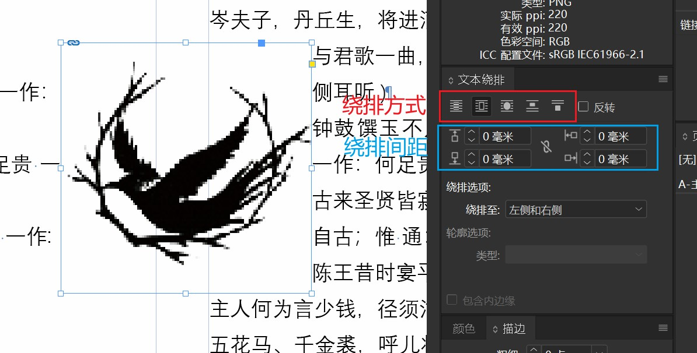
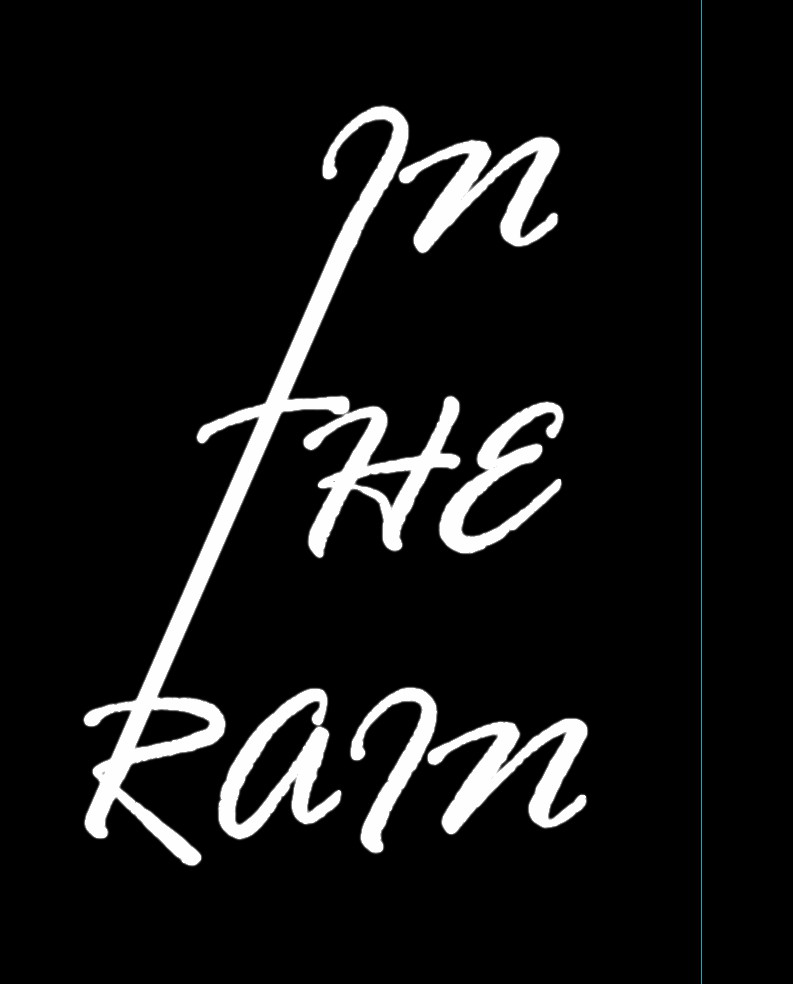

## 参考线
参考线是辅助设计师对元素进行定位的工具，灵活使用参考线可以让我们的排版统一又好看。

### 参考线的新建和编辑
先介绍参考线的添加方式：
1. 按快捷键**Ctrl+R**打开屏幕标尺
2. 在标尺上按住鼠标向屏幕中央拖动即可拉出一条参考线

::: tip
想要**删除**一根参考线，只需要按住并拖动想删除的参考线到**参考线所在的页面以外**即可。
:::

接下来介绍参考线的一些高级操作：
- 选中一条参考线，可以在**属性**面板中对它的位置进行精确修改
- 在页面空白处右键，选择**删除跨页上所有的参考线**即可快速删除当前跨页上的所有参考线

### 善用参考线
1. 查看**属性**面板中参考线的位置可以计算下一根参考线的位置
2. 参考线不宜过多，不再需要的参考线要及时删除

## 文本相关效果

### 文本绕排
1. 在 InDesign 上方的选项卡中选择**窗口->文本绕排**
2. 选中一张需要绕排的图片
3. 选择绕排方式，输入绕排间距

### 文本轮廓化
- 轮廓化后的文字不能更改字体
- 轮廓化后可以更改文字的*路径点*，以制作特殊的文字效果

1. 选中需要轮廓化的文字框架
2. 按下快捷键 **Ctrl+Shift+O** 即可
3. 然后就可以使用**直接选择工具**或者钢笔工具对路径进行修改

### 文字加粗
InDesign 软件中没有提供**加粗**这一选项，我们需要使用文字的**描边**功能对字体进行加粗：
1. 选中需要加粗的文字。  
2. 在**属性->外观**中选择描边颜色，并设置描边宽度即可。

::: tip
通常我们不会使用以上方式对文字进行加粗。调整文字粗细最好的办法是直接更改文字的**字体样式**。

:::

### 图片嵌入文字

1. 将文字轮廓化，具体步骤详见 [2.3 特殊文字效果/文本轮廓化](#文本轮廓化)
2. 复制需要嵌入的图片
3. 选中文字轮廓并右键选择**贴入内部**即可

### 首字下沉

使用**段落**面板可以快速地创建首字下沉效果。
1. 打开**段落**面板
2. 将光标停留在需要添加首字下沉的段落内
3. 调整**首字下沉行数**（调整到2以上才会有效果）即可