## 参考线
参考线是辅助设计师对元素进行定位的工具，灵活使用参考线可以让我们的排版统一又好看。

1. 按快捷键 `Ctrl+R` 打开屏幕标尺
2. 在标尺的不同位置按住鼠标左键并拖动到页面的不同位置可以创建不同类型的参考线

- 单页参考线：将鼠标放在水平或竖直标尺上，然后按住鼠标并拖动到**页面上**需要的位置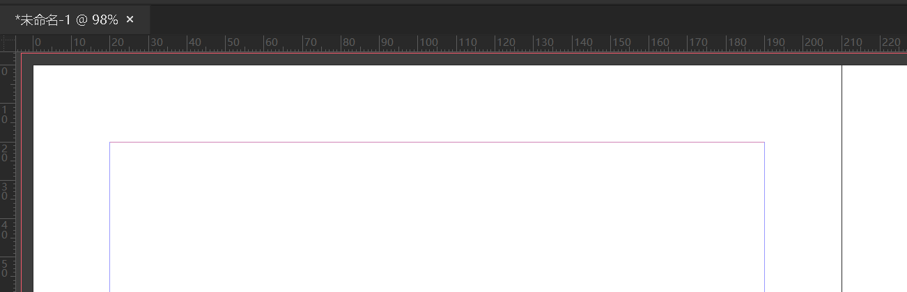
- 跨页参考线：将鼠标放在水平或竖直标尺上，然后按住鼠标并拖动到**页面外**需要的位置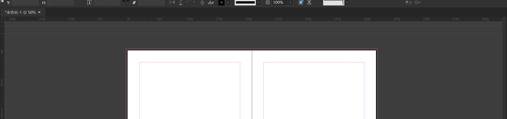
- 交叉参考线：将鼠标放在水平和竖直标尺的交界处，先按住 `Ctrl` 再按住鼠标左键并拖动到页面上需要的位置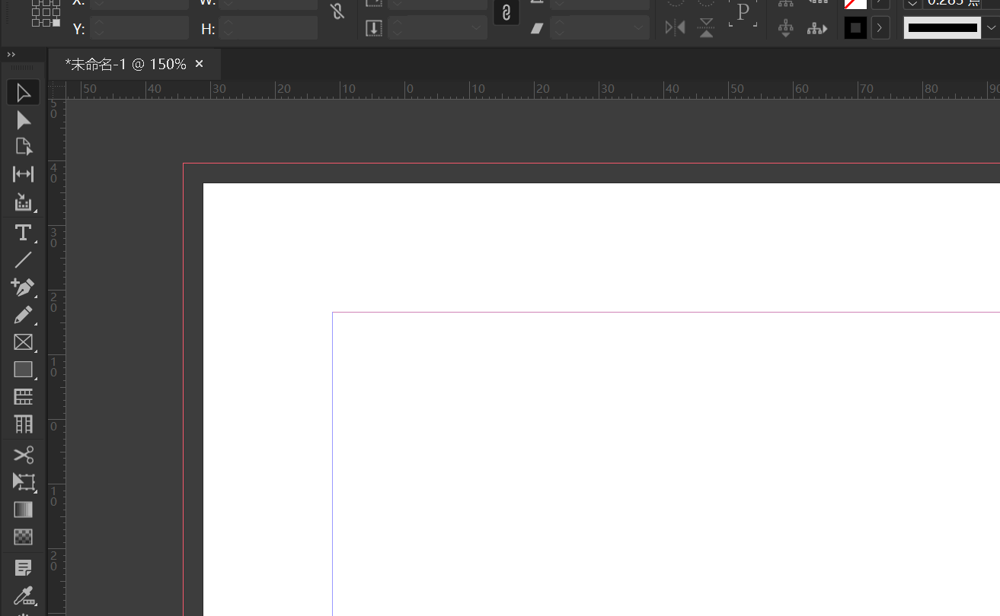

::: tip 小技巧
- 想要**删除**一根参考线，只需要按住并拖动想删除的参考线到**参考线所在的页面以外**即可
- 选中一条参考线后，可以在**属性**面板中对它的位置进行**精确修改**
- 查看**属性**面板中参考线的位置可以计算下一根参考线的位置
- 在页面空白处右键，选择**删除跨页上所有的参考线**即可快速删除当前跨页上的所有参考线
:::

## 文本绕排
1. 在 InDesign 上方的选项卡中选择**窗口->文本绕排**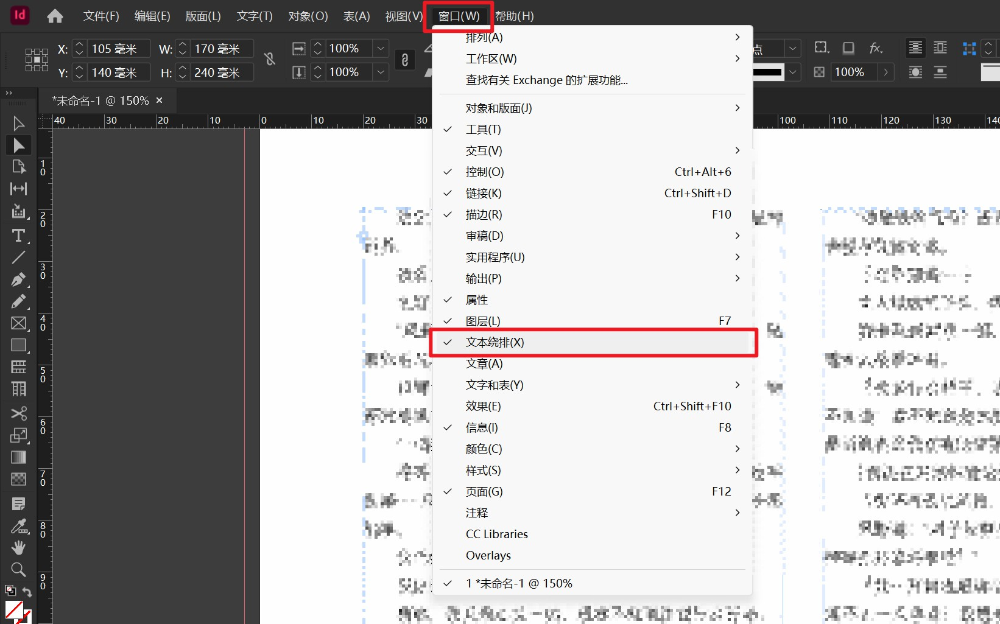
2. 选中一张需要绕排的图片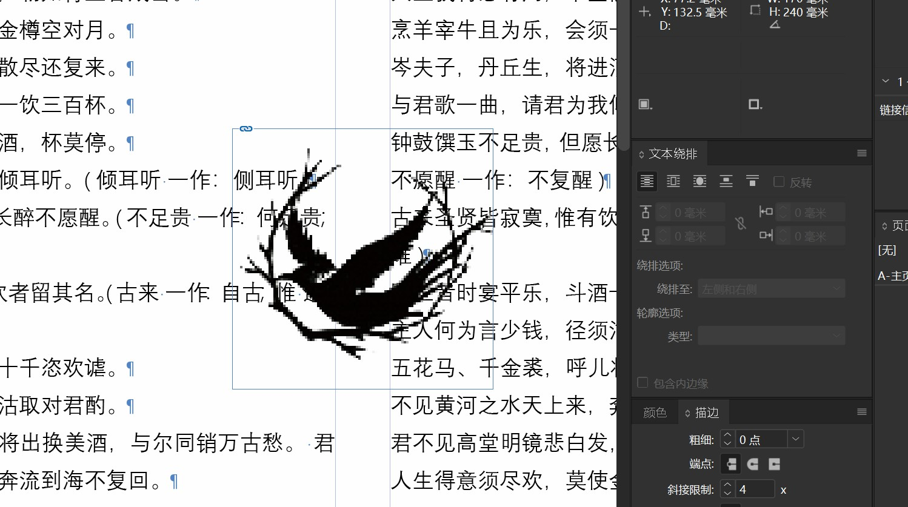
3. 选择绕排方式，输入绕排间距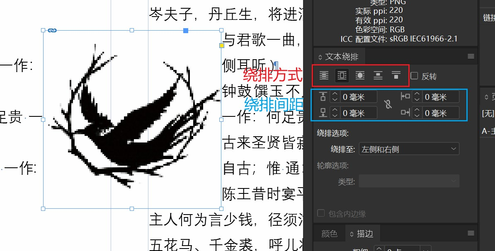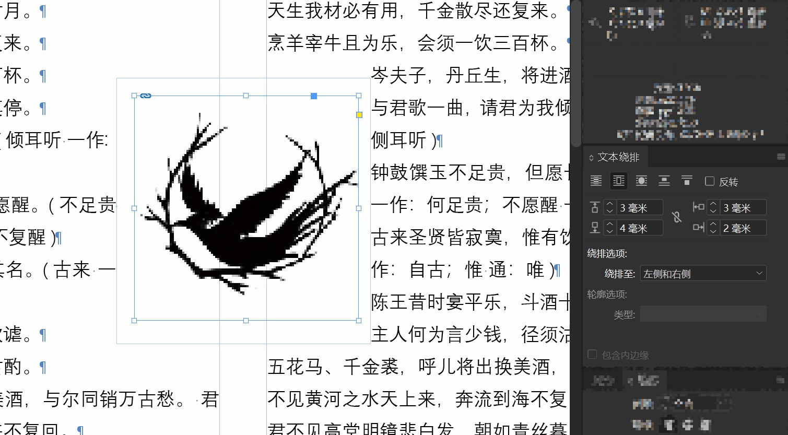

## 文本轮廓化
- 轮廓化后的文字不能更改字体
- 轮廓化后可以更改文字的*路径点*，以制作特殊的文字效果

1. 选中需要轮廓化的文字框架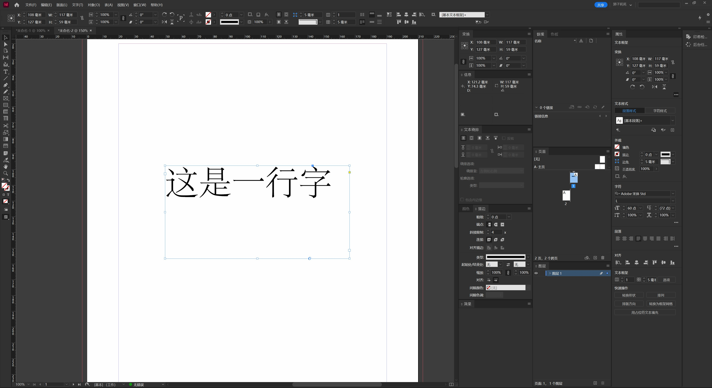
2. 按下快捷键 **Ctrl+Shift+O** 即可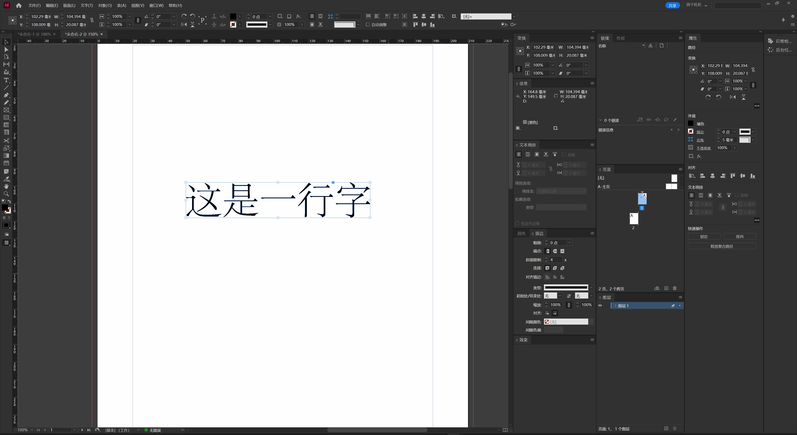
3. 然后就可以使用**直接选择工具**或者钢笔工具对路径进行修改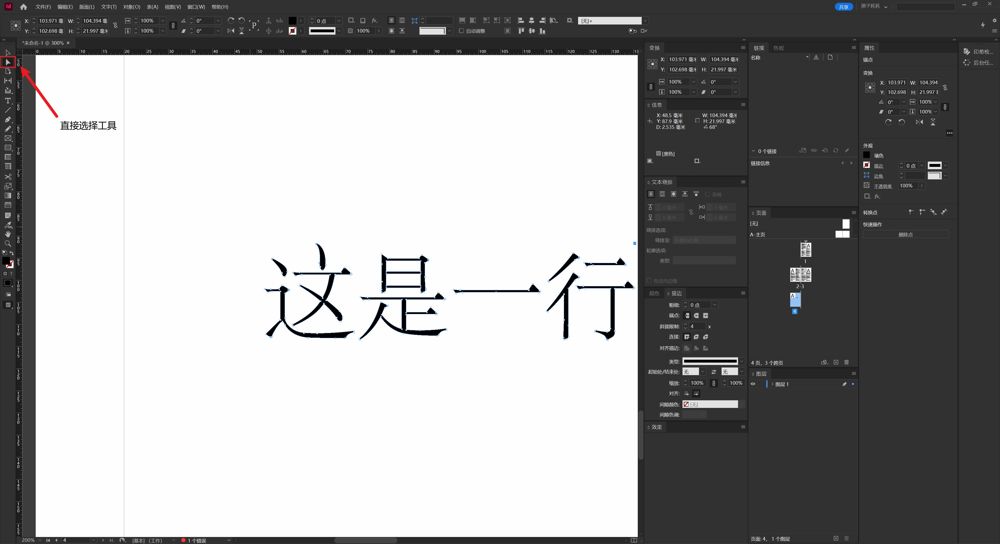

## 文字加粗
InDesign 软件中没有提供**加粗**这一选项，我们需要使用文字的**描边**功能对字体进行加粗：
1. 选中需要加粗的文字。  
2. 在**属性->外观**中选择描边颜色，并设置描边宽度即可。

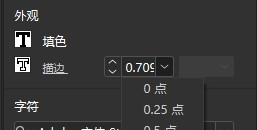

::: tip
通常我们不会使用以上方式对文字进行加粗。调整文字粗细最好的办法是直接更改文字的**字体样式**。

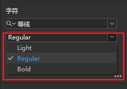
:::

## 图片嵌入文字

1. 将文字轮廓化，具体步骤详见 [2.3 特殊文字效果/文本轮廓化](#文本轮廓化)
2. 复制需要嵌入的图片
3. 选中文字轮廓并右键选择**贴入内部**即可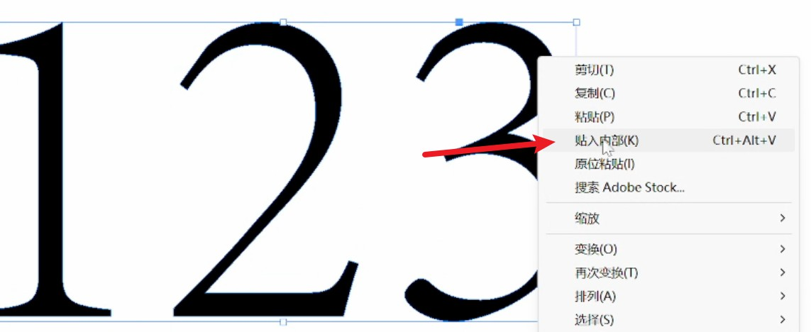

## 首字下沉

使用**段落**面板可以快速地创建首字下沉效果。
1. 打开**段落**面板
2. 将光标停留在需要添加首字下沉的段落内
3. 调整**首字下沉行数**（调整到2以上才会有效果）即可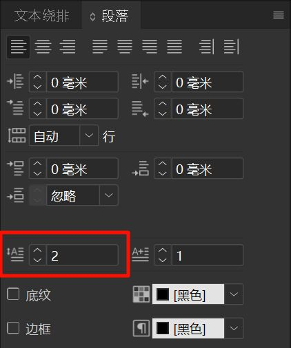

## 制表符
制表符用于将文本定位到文本框中特定的位置，常用于制作目录、职员表等。

### 添加制表符
在文本框中按下`Tab`键即可在光标位置添加一个制表符。

::: tip 显示制表符
- 制表符默认**不在文本框中显示**。
- 在文本框的输入模式下右键打开菜单，勾选**显示隐藏的字符**即可打开制表符和其他特殊字符的显示。

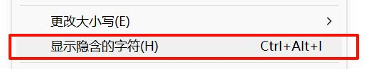
- 制表符会以以下方式显示。

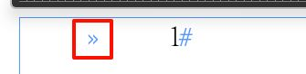
:::

### 制表符对话框
- 点击菜单栏中的**文字->制表符**以打开制表符面板，或使用快捷键`Ctrl+Shift+T`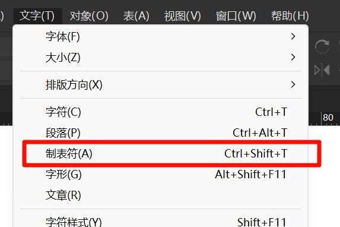
- 选中一个需要设置制表符参数的文本框，然后点击制表符面板右侧的**小磁铁图标**可以将制表符面板与文本框对齐
- 制表符面板中央是**定位尺**，在它上面点击可以添加制表符，左右拖动可以改变制表符的位置
- 制表符面板中提供了多种文字与制表符位置的对齐方式
    - 左对齐/居中对齐/右对齐
    - 小数点对齐：选中后在**对齐位置**中输入需要对齐的字符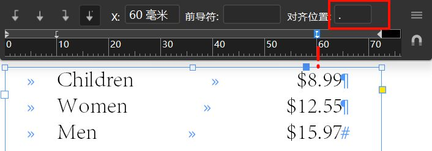
- **X**为制表符位置，选中它后可以手动输入数值，或者按键盘上的`向上/向下`键以整毫米数增大/减小它的值

### 设置制表符
1. 打开**显示隐藏的字符**，方便观察制表符的位置
2. 在文本框中需要添加制表符的位置使用`Tab`键添加制表符
3. 点击菜单栏中的**文字->制表符**以打开制表符面板
4. 选择需要设置制表符的文本框，点击制表符面板中的小磁铁将它与文本框对齐
5. 使用选择工具选中文本框，或使用文本工具选中需要设置制表符的段落
6. 单击**定位尺**上的某一位置以定位新的制表符
7. 在**X**框中输入位置，然后按下`Enter（回车）`键
8. 重复步骤6-7以定位多个制表符

### 删除制表符
你可以通过以下三种方法删除一个/多个制表符

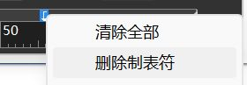
- 将制表符**拖离**制表符标尺
- 右键单击需要删除的制表符，然后选择**删除制表符**
- 右键单击需要删除的制表符，然后选择**清除全部**

### 添加制表前导符

> _制表前导符_ 是制表符和后续文本之间的一种重复性字符模式（如一连串的点或虚线）。

1. 在制表符面板中，选择一个需要添加前导符的制表符
2. 在**前导符**框中输入需要重复显示的字符

::: tip 双制表符实现截断前导符的效果
在同一位置**连续使用两个制表符**可以实现如下的特殊效果。

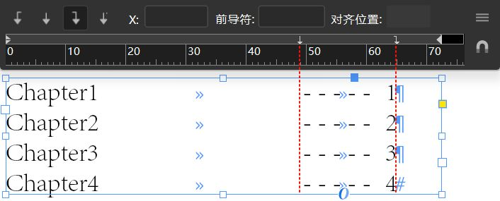
:::

## 查找/替换字体
在一些情况下，我们可能需要将文档中的某个字体统一替换成另一种字体，为了避免重复操作，InDesign 为我们提供了一个方便的操作面板。

点击软件上方菜单栏中的**文字->查找/替换字体**即可打开查找/替换字体面板。

### 替换字体
在这个面板中，我们可以查看文档中**已经使用过的字体**，并对其进行统一替换。
1. 在**字体信息**中选择一个需要替换的字体
2. 在下方的**替换为**中选择要替换为的字体和字体的样式
3. 点击**更改**或**全部更改**按钮对字体进行替换
	1. `更改`：只会替换当前选中位置的字体（点击**查找下一个**可以跳转到下一个使用了这个字体的位置并选中）
	2. `全部更改`：将文档中**所有**使用了该字体的位置全部替换为指定的字体

### 查找字体
该面板不仅可以用于替换字体，还可以快速定位字体在系统中的位置。
1. 在**字体信息**中选择一个需要查找的字体
2. 点击面板右侧的**在资源管理器中显示**按钮，InDesign 会打开该字体文件所在的目录并选中该字体