::: info
以下面板均可以在软件上方菜单中的**窗口**选项卡中开启。
:::

## 链接面板
在该面板中可以便捷地查看所有链接和嵌入到本文档的素材。
在 InDesign 中，默认情况下素材是不会随着 indd 文件一起保存的，它们只会被**链接**到 InDesign 软件当中。当素材内容发生变化时，InDesign 中的内容也会相应地发生变化。
素材也可以通过链接面板中的**嵌入**按钮嵌入到 indd 文件当中。这样素材就会随着 indd 文件一起被保存。但这样做会导致 indd 文件变得非常大，在每次保存 indd 文件时都需要花费大量的时间等待硬盘写入完成，而且嵌入的素材无法便捷地修改。所以我们通常不会将素材嵌入到 indd 文件当中。

## 印前检查面板
在该面板中可以定位和排除**字体丢失**、**素材丢失**和**溢流文本**等问题。
双击面板中黄色的数字可以定位到出现问题的元素上。

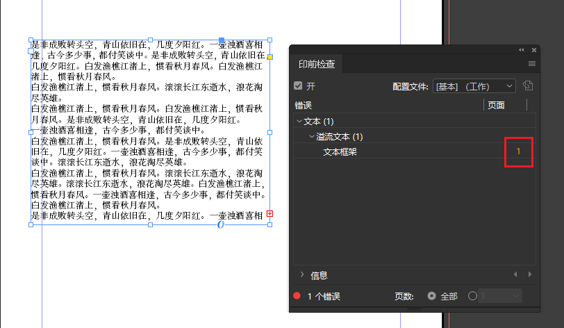

## 属性面板
该面板提供了对于**选中的对象**各种属性的修改。
| 选中链接的文件 | 选中文本框架 |
| -------------- | ------------ |
|  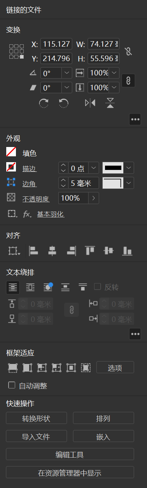  | 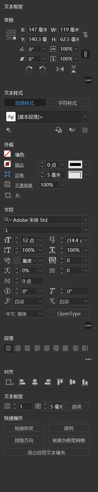 |

## 对齐面板
该面板提供了很多有用的对齐控件。

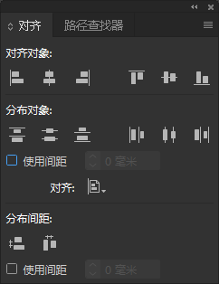

## 拾色器面板
选中需要更改颜色的元素以后，双击左侧面板中的**T**即可打开拾色器。

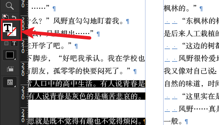

在拾色器中我们可以选择不同的色板模式：
- HSB（色相H/饱和度S/亮度B）
- RGB（红色R/蓝色B/绿色G）
- LAB（CIE制定的一种测定颜色的国际标准）
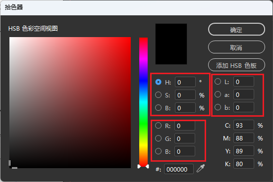

## 效果面板
该面板中可以为选中的对象添加一些特殊效果：
1. 右键点击需要添加效果的对象
2. 选择**效果**->**需要的效果**直接进入对应的效果面板选项卡
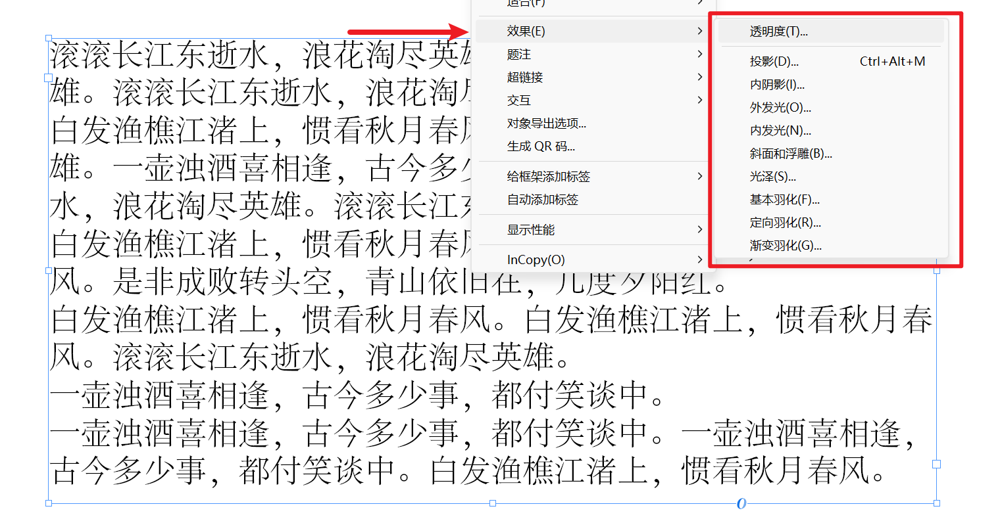

::: tip 试一试
效果面板的效果需要**多试、多用**才能熟练运用。
:::
### 基本羽化
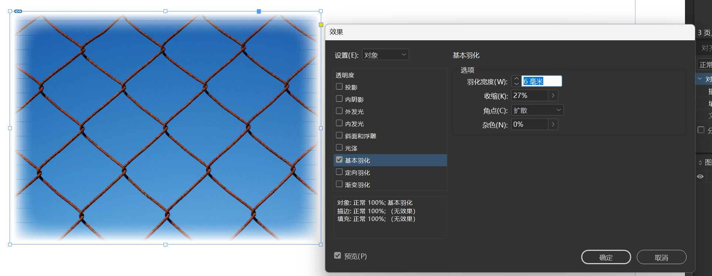

- 羽化宽度：调整羽化的宽度
- 收缩：调整羽化向内渐变的程度
- 角点：调整图片转折点的羽化方式
- 杂色：为羽化添加杂色

### 定向羽化
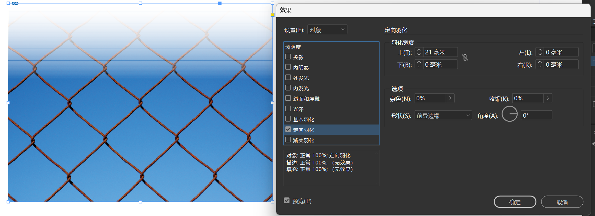

- 羽化宽度：定向羽化中可以调整四个方向的羽化程度
- 角度：调整参考系的角度
- 形状：不同的羽化模式
- 杂色：为羽化添加杂色

### 渐变羽化（最灵活）
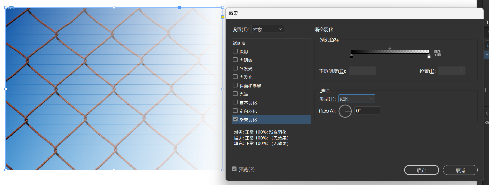

- 渐变色标：用于调整渐变羽化的位置和程度
    - 纯黑色对应**100%不透明度**（完全不透明）
    - 纯白色对应**0%不透明度**（完全透明）
- 类型：羽化模式
- 角度：渐变的角度

### 投影
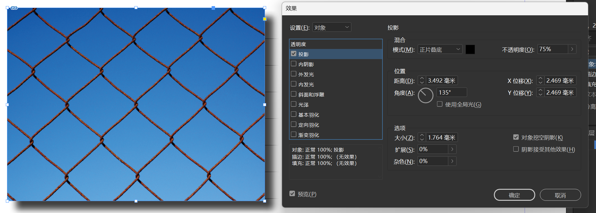
