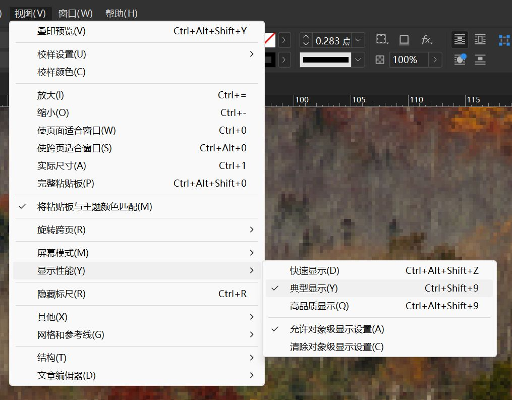
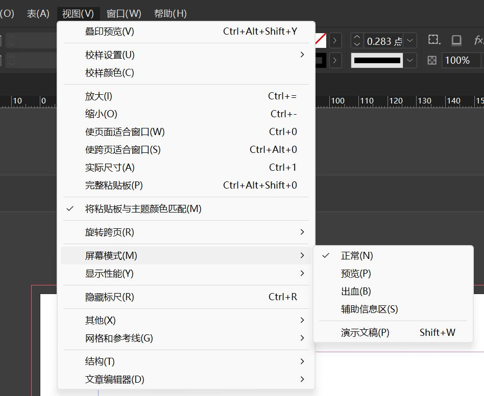
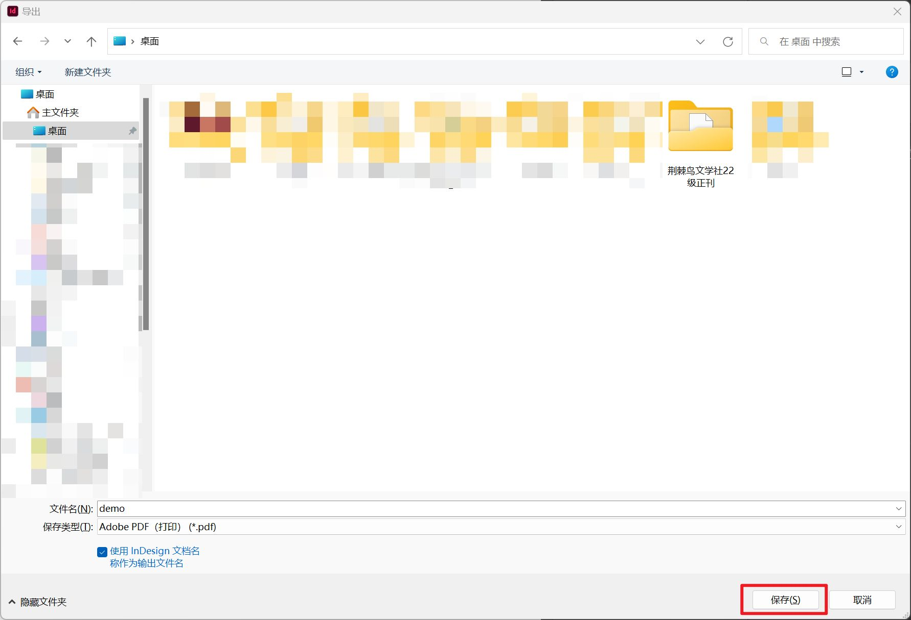
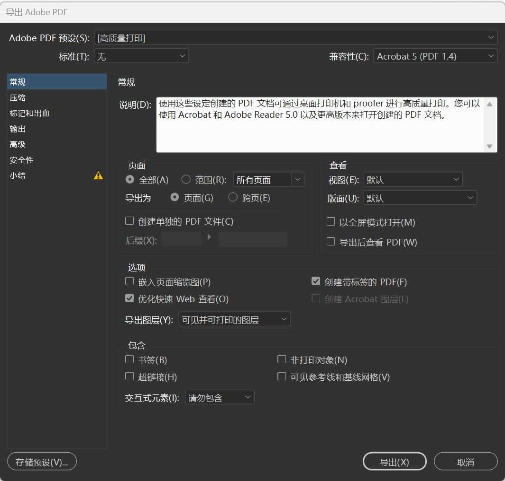
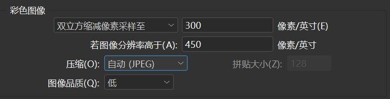
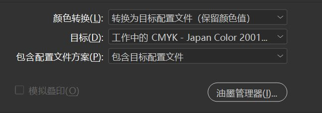
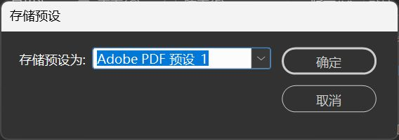

## 普通预览
### 显示性能

::: info 默认显示
InDesign 默认使用**典型显示**，该显示设置下图片分辨率会被**降低**。
> 默认设置可以在 首选项->显示性能 中修改。

:::

1. 点击上方菜单栏中 视图->显示性能 即可打开该设置
    1. 快速显示：不显示任何图片，仅显示图片占位符
    2. 典型显示（默认）：将图片**降低分辨率**显示以换取更高的显示性能
    3. 高品质显示：不降低图片分辨率显示
2. 对象级显示设置：右键图片也可以找到**显示性能**设置，在每个图片上设置的显示性能称为**对象级显示设置**

默认情况下使用**典型显示**即可，需要查看高质量图片时务必使用**高品质显示**。

### 屏幕模式

点击上方菜单栏中 视图->屏幕模式 即可打开该设置。

- **正常模式**：显示版面及所有可见网格、参考线等
- **预览模式**：（遵循**显示性能**设置显示图片）完全按照最终输出显示图稿，所有非打印元素（网格、参考线）都不会显示，背景使用 首选项->参考线和粘贴板->颜色->预览背景 中设置的颜色
- **演示文稿模式**：（图片**不会被降低质量**）以幻灯片演示的形式显示图稿，不显示任何菜单、面板或工具

> - 出血模式：完全按照最终输出显示图稿，所有非打印元素（网格、参考线、非打印对象等）都被禁止，粘贴板被设置为“首选项”中所定义的预览背景色，而文档出血区（在“文档设置”中定义）内的所有可打印元素都会显示出来
> - 辅助信息区模式：完全按照最终输出显示图稿，所有非打印元素（网格、参考线、非打印对象等）都被禁止，粘贴板被设置成“首选项”中所定义的预览背景色，而文档辅助信息区（在“文档设置”中定义）内的所有可打印元素都会显示出来

::: tip 快捷键
选中空白区域时：按下 `w` 键切换**预览模式/正常模式**；按下 `shift+w` 键切换**演示文稿模式/正常模式**。
:::

## 叠印预览
叠印预览是一种在图形设计和印刷领域使用的功能，它可以模拟印刷时油墨叠印的效果，以便设计师在屏幕上预览最终的印刷成品。

点击软件上方菜单栏中的**视图->叠印预览**或使用快捷键 `Ctrl+Shift+Alt+Y` 即可打开/关闭叠印预览。打开叠印预览后，文件名旁会显示[叠印预览]。

::: info 叠印
叠印是指在印刷过程中，将两种或多种不同颜色的油墨在同一区域重叠印刷的技术。通过叠印，油墨会混合产生新的颜色，同时也能避免因颜色镂空而产生的白色缝隙，常用于增强色彩饱和度、避免细微线条的断裂以及实现特殊色彩效果。在设计软件中，需要开启叠印预览才能准确模拟印刷效果。

因为叠印中不同颜色的油墨会相互覆盖，所以对使用了**透明度**的图层影响非常大。建议在调整了图像透明度后，打开叠印预览查看效果是否和预期的一致。

:::

::: tip 叠印预览只用于查看印刷效果
因为叠印预览会加载全分辨率素材，并且需要消耗 CPU 资源渲染叠印效果，所以打开叠印预览时滑动页面会存在明显卡顿。建议只将它用于提交排版和印刷前的最后检查。
:::

## 导出

::: info 图片压缩
InDesign 导出 PDF 的默认设置会对图片进行**缩减像素采样**。这一操作会**降低图片分辨率**，需要在导出页面更改输出方式才能获得清晰的图片。
:::

1. 点击上方菜单栏中的文件->**导出**或使用快捷键 `Ctrl+E` 打开导出界面
2. 选择导出文件的保存位置后点击右下角的**保存**按钮
3. 调整导出设置后点击**导出**按钮即可

### 导出参数

> 导出印刷稿参数详见 [6.2 排版汇总](../ChapterNo6/6.2.md#导出印刷稿)

#### 常规
- 说明：当前预设的解释说明
- 页面
    - 全部：导出所有页面
    - 范围：输入**1-2**导出第一页到第二页的内容，范围使用“-”分隔
    - 导出为
        - 页面：单页
        - 跨页：将左右两页作为一页导出
    - 创建单独的 PDF 文件：将每一页都导出为一个 PDF 文件
- 选项
    - 嵌入页面缩览图：嵌入缩览图后在文件资源管理器中会看到 PDF 的缩略图（会略微增加 PDF 文件的大小）
    - 优化快速 Web 查看：优化在网络上传播的 PDF 文件加载速度
    - 导出图层：控制导出图层的方式（通常为减小文件体积会选择**可见并可打印的图层**

#### 压缩

以**彩色图像**为例：
- 像素采样：
    - 不缩减像素采样：不降低图片品质
    - 缩减像素采样：当图像分辨率高于**设定值**时会触发**缩减像素**（InDesign 提供了三种缩减像素采样的方法）
        - 双立方
        - 次像素
        - 平均
- 压缩
    - 压缩方式
        - 无：不压缩（文件体积较大）
        - JEPG（转换为**有损**图片以压缩文件体积）
        - ZIP（建议使用，**不影响**图片品质）
    - 图片品质：有损压缩的品质选项

#### 标记和出血
- 裁切标记：印刷品的裁切标记，用于印刷厂的裁切
- 出血标记：文档的出血线标记，勾选该选项后，导出的文件中会包含文档出血区域的内容

::: warning 导出印刷稿时，务必打开导出中的**出血标记**
必须打开导出选项中的**出血标记**。如果印刷稿中不带有出血标记，则印刷厂会将页面进行放大处理，以避免最后切割印刷品的时候出现白边等问题。放大后会让原有的版面被裁切掉一部分，影响最终的印刷效果。
:::

#### 输出
该页面主要用于控制输出文件的**色彩空间**。

- 颜色转换：是否将不同的颜色空间转为下方的目标值
- 目标：设定需要转换到的色彩空间
- 包含配置文件方案：是否将色彩空间配置嵌入 PDF 文件中

::: tip 保存导出设置
在导出面板设置好各项设置之后，可以点击左下角的**存储预设**按钮保存当前设置以供下次使用

:::
