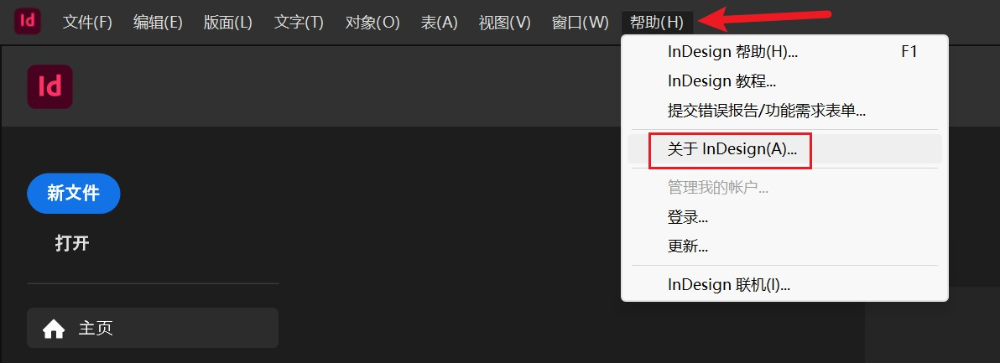
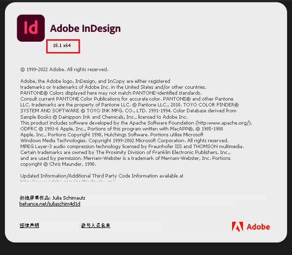

本节介绍 Adobe InDesign 软件的安装和使用步骤。

## InDesign 软件下载
~~InDesign 软件可以在 [weibo@vposy](https://weibo.com/u/1112829033) 下载。~~

::: info vposy 停止更新 Adobe 系列软件
> vposy 微博原文：
> 因工作调动，已无时间维护，故暂停更新。
> 只有微博是本人，其他渠道均为冒充。 ​​​
> 2023.8.11
:::

> vposy 制作的 Adobe 系列软件补档
> 链接：https://pan.baidu.com/s/1L8GGEv-YklIusnXEdIurZQ
> 提取码：i415

其他下载途径：
- [Adobe Apps Patching](https://genpguides.github.io/)：Adobe 应用程序 Patching 集合（包含了以下两种 Patching 的安装指引）
  - [GenP](https://www.reddit.com/r/GenP/)：GenP Patching
  - [Monkrus Webside](https://w14.monkrus.ws/)：Monkrus Patching

## InDesign 软件版本
1. 打开 InDesign 软件。
2. 点击上方菜单栏的帮助。
3. 选择“帮助”菜单中的“关于 InDesign 选项”。
4. 在弹出的窗口中会显示软件的版本信息

> 对该版本号的补充说明：  
> **18.1** 是当前 InDesign 的版本号。
> **x64** 是当前软件的架构，不是我们需要关心的版本号。
> 不同的电脑有不同的架构，通常为 **x86** 或 **x64**，分别对应 **32位** 和 **64位**。
> 电脑的架构可以在**控制面板**->**系统**中查看。
> **64位** 的系统通常可以运行 **64位** 的软件和 **32位** 的软件；**32位** 的系统只能运行 **32位** 的软件。
