## 去除图片背景
去除图片背景俗称抠图，是通过对图片的处理将背景色去除的过程，也可以从图中去除不需要的元素。

### 使用 Photoshop 一键抠图

> 该功能需要 Adobe Photoshop 软件版本 >= CC 2018

1. 使用 Adobe Photoshop 打开需要处理的图片
2. 在图层面板中解除需要操作的图层锁定
3. 选中需要操作的图层，按快捷键 `Ctrl + J` 复制一层（不复制也可以操作，但最好备份一层）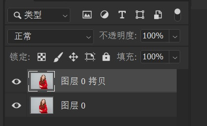
4. 点击**属性**面板中**删除背景**按钮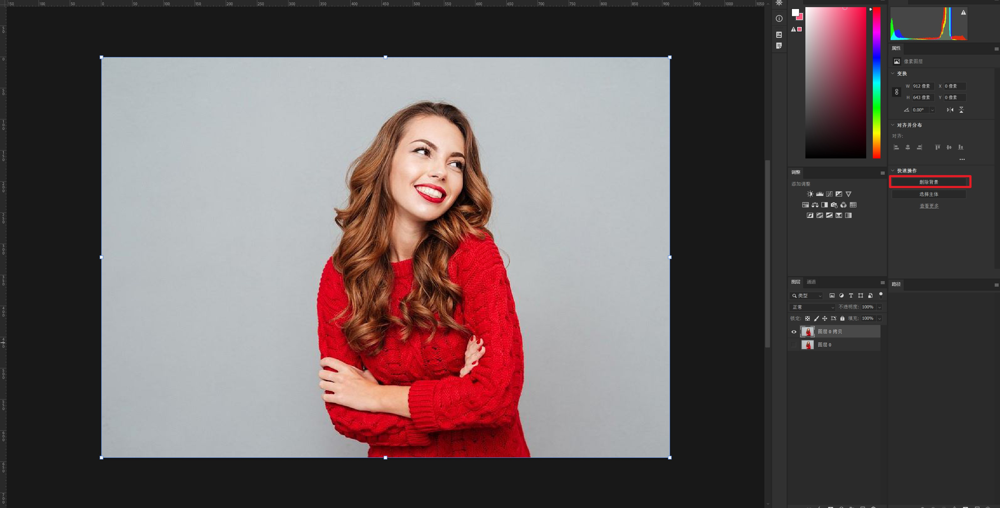
5. 等待软件计算完成即可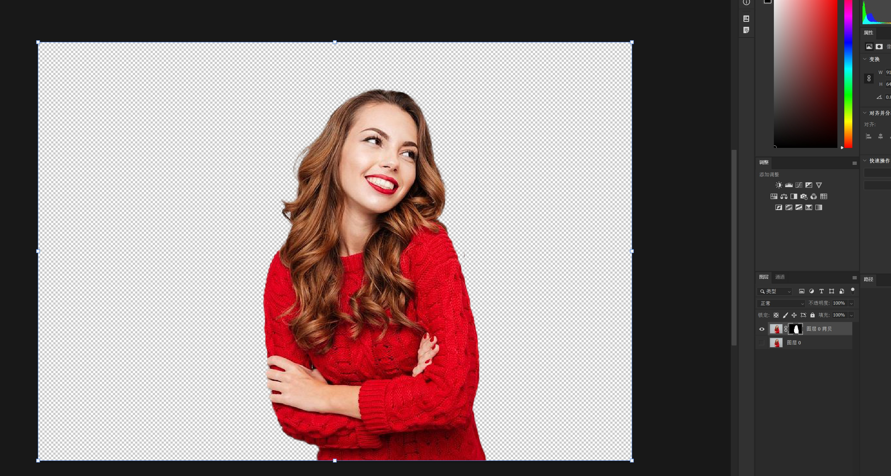
6. 此后可以通过画笔工具微调该图层的蒙版进行精细化调整

### 手动抠图
很多情况下自动抠图并不能满足我们的需求，这种时候就需要进行手动抠图。
1. 使用 Adobe Photoshop 打开需要处理的图片
2. 在图层面板中解除需要操作的图层锁定
3. 选中需要操作的图层，按快捷键 `Ctrl + J` 复制一层（不复制也可以操作，但最好备份一层）
4. 选择左侧面板中的**钢笔**工具或使用快捷键 `P` （需要在输入法为英文的状态下该快捷键才能生效）
5. 使用钢笔工具在需要抠出的对象周围画出轮廓并将它封闭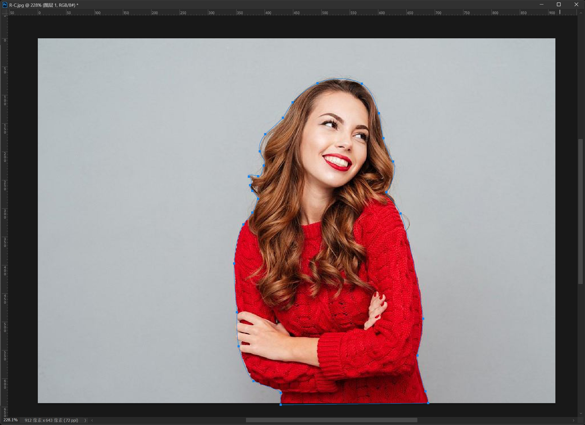
6. 点击左上角工具栏的**选区**按钮建立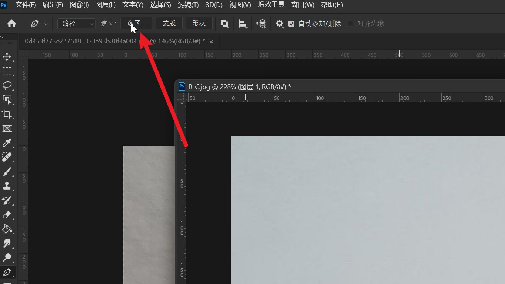
7. 适当调整*羽化半径*（羽化会在画出的轮廓周围添加渐变效果）并点击确定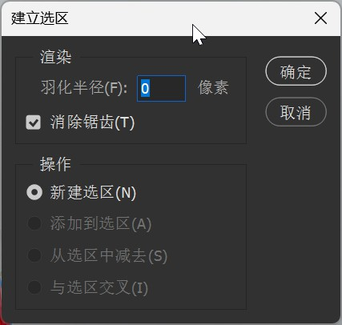
8. 选中需要抠图的图层，点击**图层面板**中的**添加图层蒙版**按钮即可。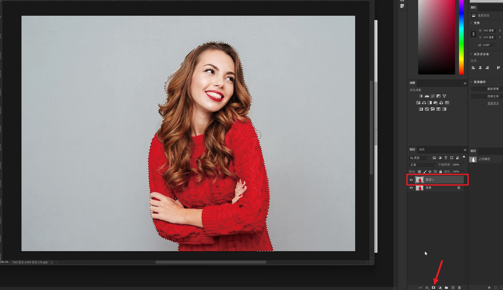
9. 此后可以调整图层蒙版对抠图进行微调

::: tip 修图的各种参数介绍

下方的视频中详细介绍了曝光/亮度、对比度、饱和度/自然饱和度、锐度/清晰度的原理，非常建议观看。

<iframe src="//player.bilibili.com/player.html?isOutside=true&aid=1652270504&bvid=BV16j421d7HB&cid=1482680386&p=1" scrolling="no" border="0" frameborder="no" framespacing="0" allowfullscreen="true" width=100% height=300px></iframe>

:::

## 对比度
对比度描述的是图片中**亮部和暗部分之间的差异程度**。
在一个高对比度的图片中，你能够清晰地看到每一处细节，无论是最亮的亮点还是最暗的暗影，它们之间的界限非常明显，就像黑白分明一样。这样的图片看起来色彩鲜明，给人以强烈的视觉冲击。

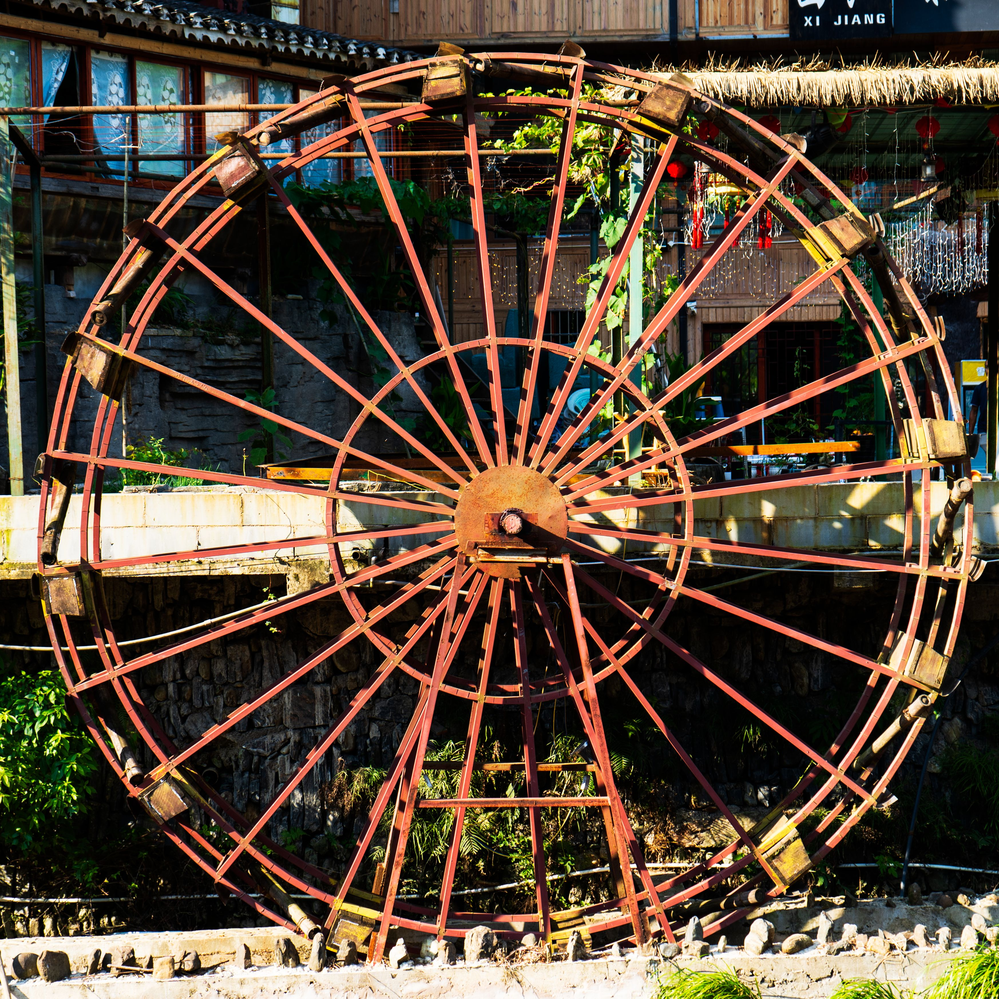

而低对比度的图片则显得颜色和层次都相对模糊，细节不够突出，整体上看起来比较柔和，但可能缺少清晰度和立体感。

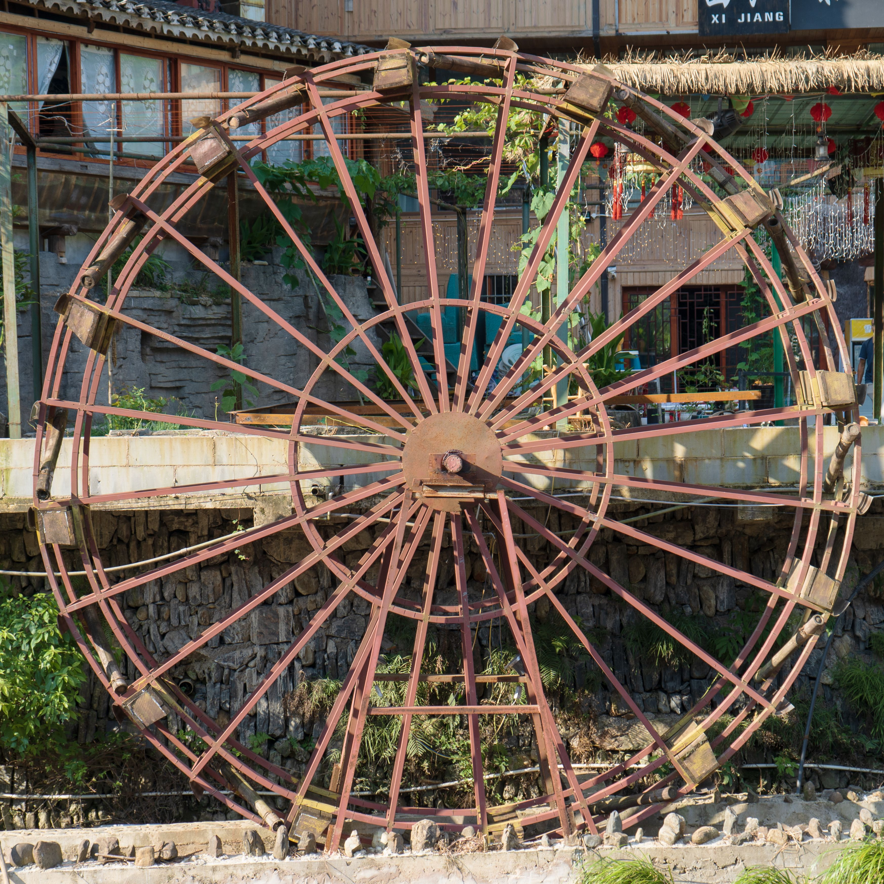

## 饱和度
饱和度是指**色彩的纯度**，一种颜色的饱和度越高，它就越鲜艳；反之，一种颜色的饱和度越低，它就越接近于灰色。

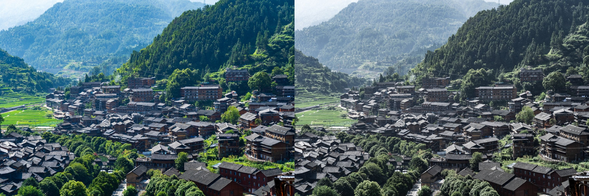

左侧的图片饱和度较高，整体的色彩比较鲜艳；右侧的图片饱和度较低，因此整体的颜色更加偏向于灰色。

### 自然饱和度
自然饱和度又名*鲜艳度*/*智能饱和度*，它同样可以调整画面的鲜艳程度，但不同于饱和度，它更加智能，会主要增强那些本来就不太鲜艳的颜色，而对已经很鲜艳的颜色保持不变。这样可以让图片看起来既鲜艳又自然，一定程度上避免过度饱和导致的失真。

饱和度适合那些想要强烈视觉效果或者需要大幅调整色彩的情况；而自然饱和度则适用于需要细微调整，保持某些关键区域（如肤色）自然的情况。

部分情况下，我们也可以降低饱和度，并提高自然饱和度以获得更加自然的画面。

## 曲线

::: tip 在 Adobe Photoshop 中打开曲线工具
选中需要添加曲线工具的图层，在**调整**面板中单击**曲线**即可为所选的图层添加曲线调整图层。

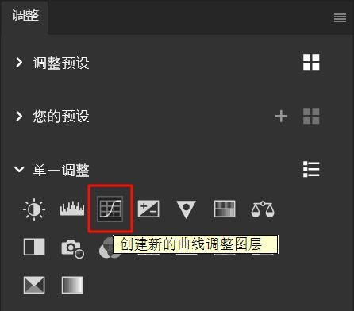
:::

::: tip 手机修图软件中的曲线工具
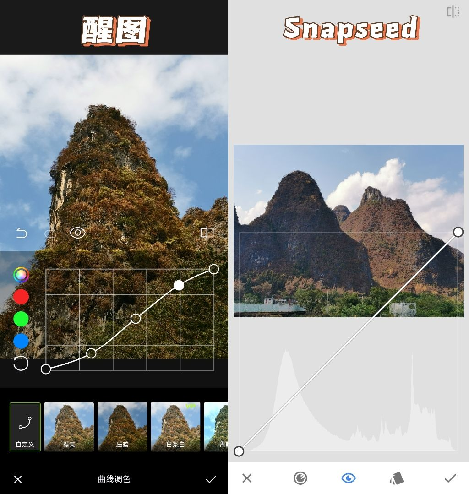
:::

### 曲线的原理

曲线工具是一个非常重要的色彩和影调调整工具，常常被称作**调色之王**。

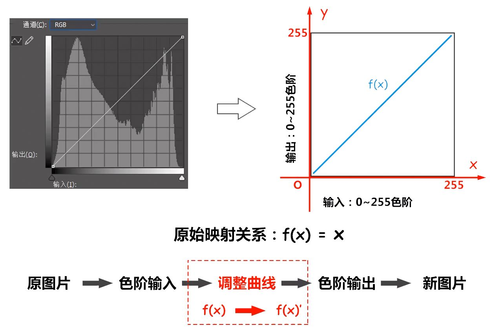

RGB 曲线调整的本质是**对原图亮度的变换**。

曲线的横轴是**原图的亮度**，从左到右依次是：
- 0：纯黑（最黑）
- 1-254：中间灰色值
- 255：纯白（最亮）

曲线的纵轴是原图**调整后**的亮度，从下到上是 0-255 的亮度值。

横纵轴围起来的范围内显示了一个**色阶直方图**，它展示了原图的每一个亮度值上，分别存在着多少个像素。

色阶直方图上的白线就是**曲线**，它反映了原图亮度值和目标图（即调整后的图片）亮度值的映射关系。

当我们在曲线上任意取一个点，它的**输入值**就是横轴对应的数值，即原图中的亮度；它的**输出值**就是纵轴中的数值，也就是调整后它的亮度值。

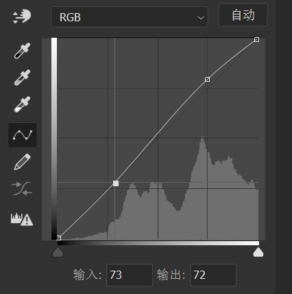

接下来以一个常见的 **S 形曲线** 为例说明曲线的作用。

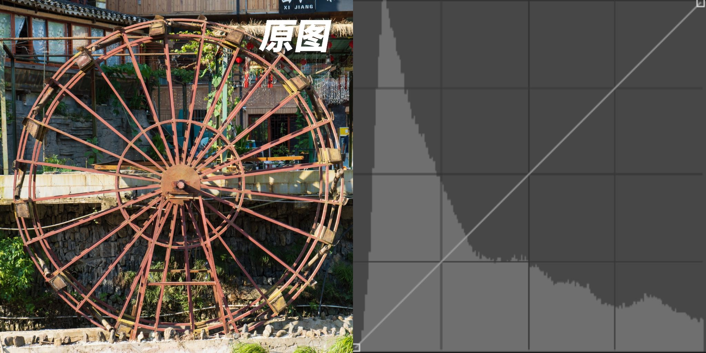

在原图中，我们可以看到图像的对比度不够高，导致图像有些发灰，因此我们使用 **S 形曲线** 来提高图像的对比度。

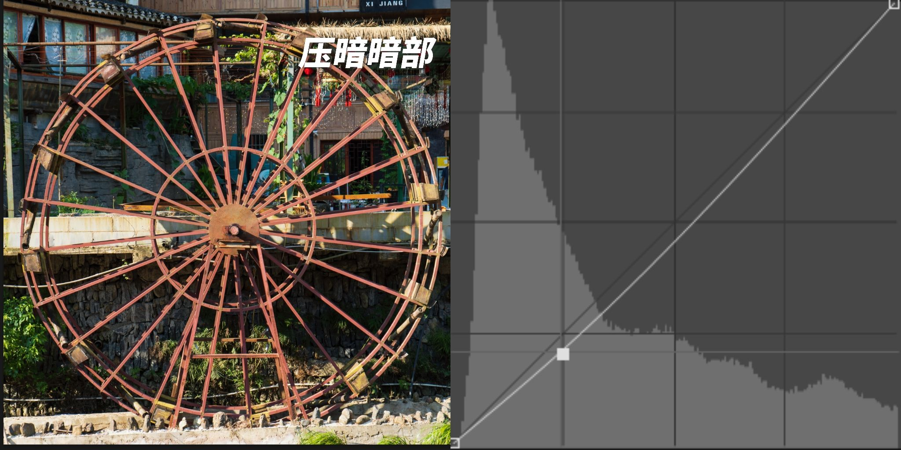

在曲线的**左侧**新建锚点，将锚点**向下**移动少许。

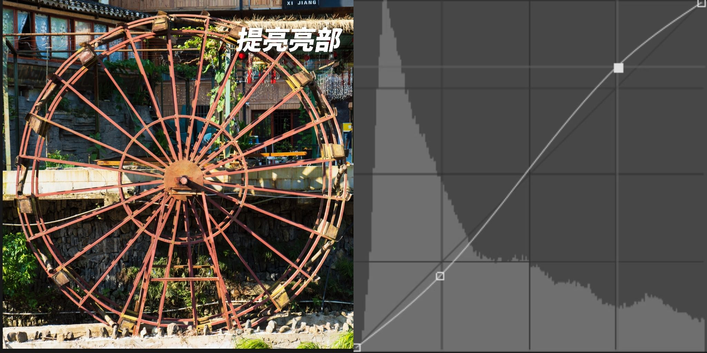

在曲线的**右侧**新建锚点，将锚点**向上**移动少许。

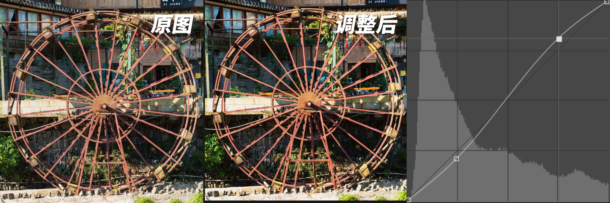

调整后我们可以发现，图像的对比度得到了提高，**亮部更亮、暗部更暗**，图像发灰的情况得到了明显改善。

::: tip 曲线和其他工具
尽管曲线的功能非常强大，但是调整曲线通常不是一个简单的过程。更多的时候，诸如 LRC 中**高光、阴影、白色色阶、黑色色阶**的调整，会比曲线更容易上手，在做一些简单调色的时候会更加好用。
:::

### 11 种经典曲线

> 11 种曲线图片均来自 @bilibili [在逃柯学家](https://space.bilibili.com/251960524)

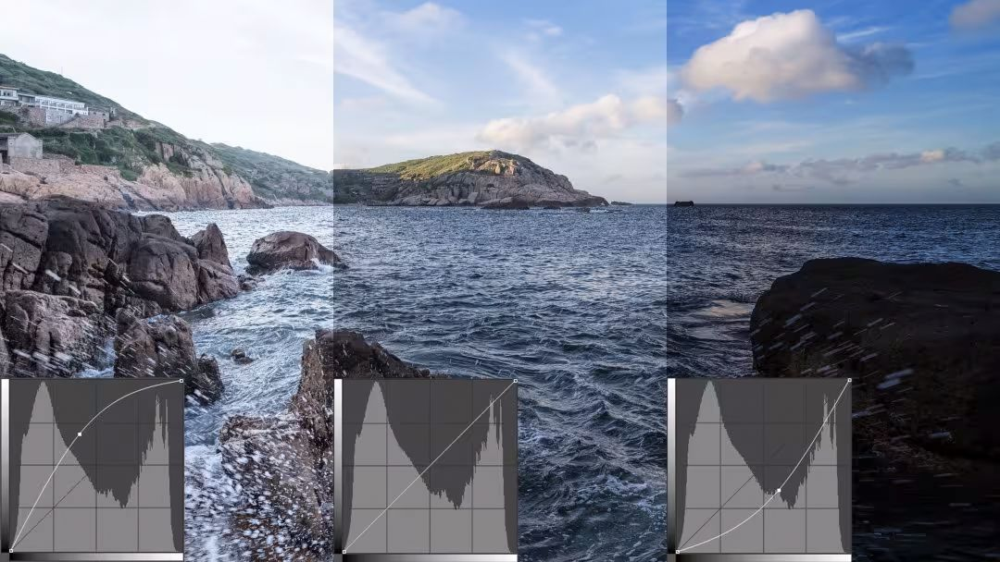

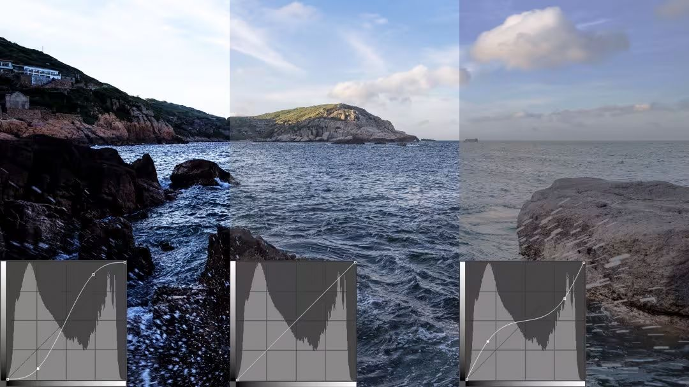

> “S”型曲线加大图像对比度，亮部更亮，暗部更暗，反“S”型曲线降低图像对比度。

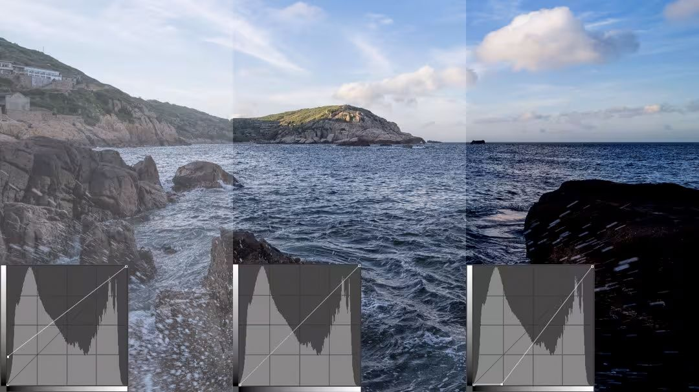

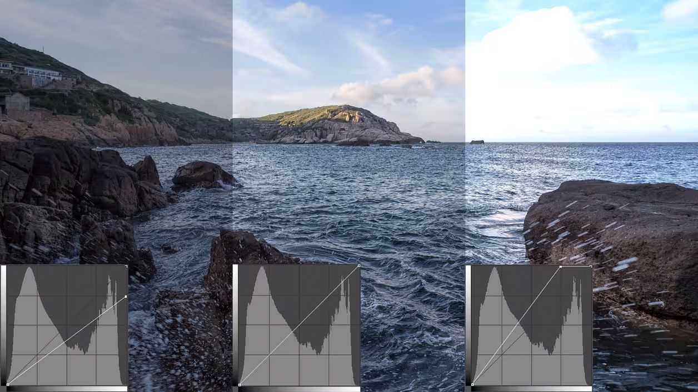

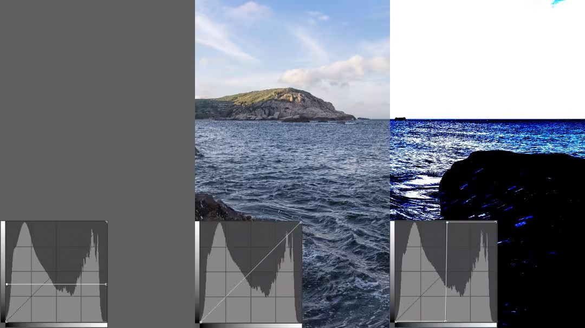

> 水平意味着不同级别的灰度，竖直类似色调分离效果，用有限几个颜色显示整个图像。不难得出曲线越平，图像反差越小，越发灰；曲线越接近竖直，图像反差越大，对比越强烈。

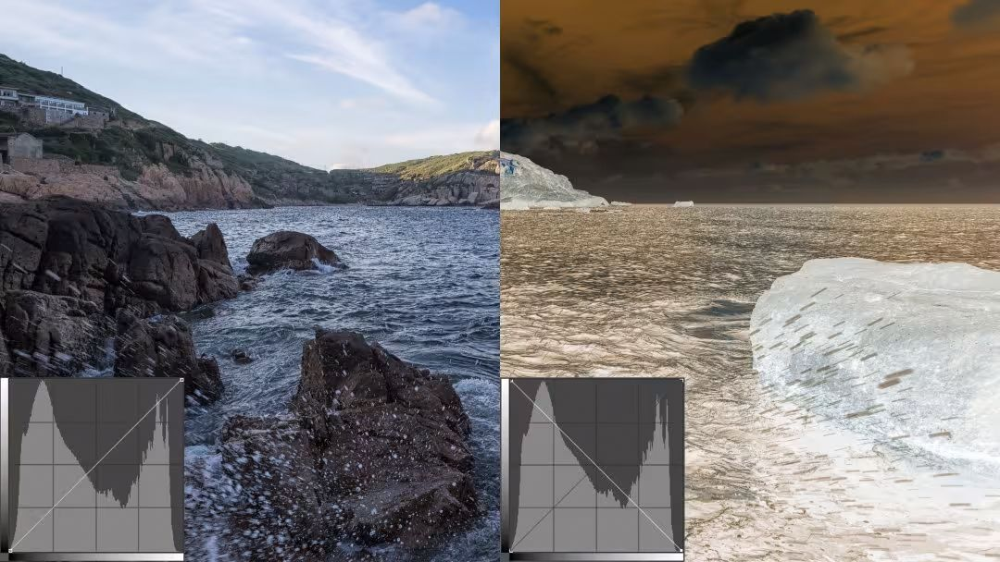

### 单通道曲线
在曲线面板的选项卡中可以单独选择**红**、**绿**或**蓝**通道来调整对应色彩的亮度曲线。

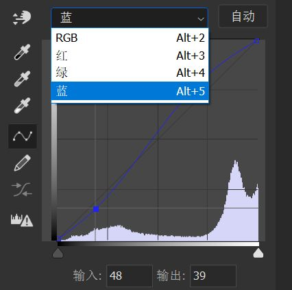

通过调节不同色彩的曲线，我们可以对原片实现风格化处理。

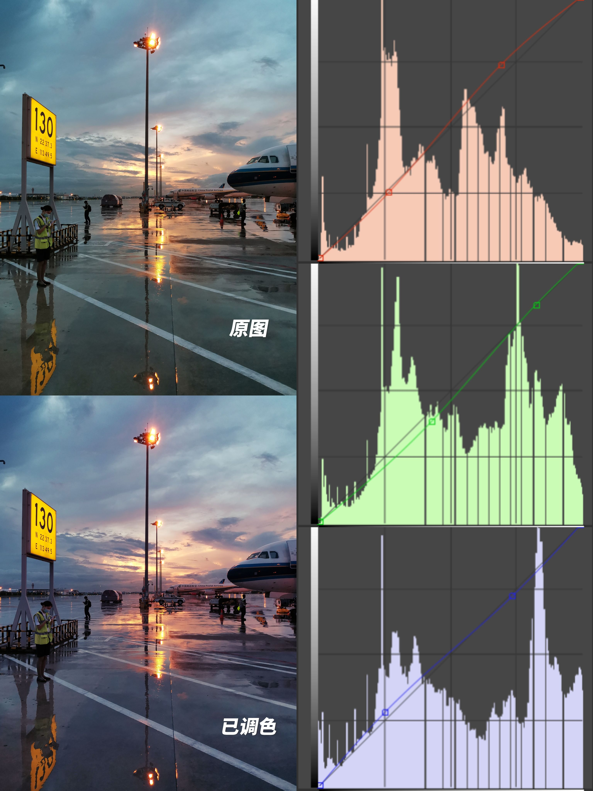

- 红色：提亮亮部以使得晚霞更加红润；略微压暗暗部以平衡色差
- 绿色：压暗中灰部，使得画面偏紫色色调
- 蓝色：提亮暗部以使得画面暗部偏蓝紫色；略微压暗亮部以平衡色差

### 使用曲线调色的步骤
使用曲线调色时，我们通常可以按照以下步骤进行
1. 在脑海中比对需要得到的画面与现存画面存在哪些区别，**一定要知道自己调色的目标是什么**
2. 使用 **RGB 曲线** （配合蒙版使用可以改变部分区域的明暗关系）调整画面的对比度和明暗关系
3. 在**单通道曲线**中按照预想实现色调的风格化
4. 在**单通道曲线**中进行微调，矫正因为风格化而产生的偏色

> 第三步和第四步有时也会调换：先在曲线中打下锚点固定部分的亮度，再添加锚点进行风格化