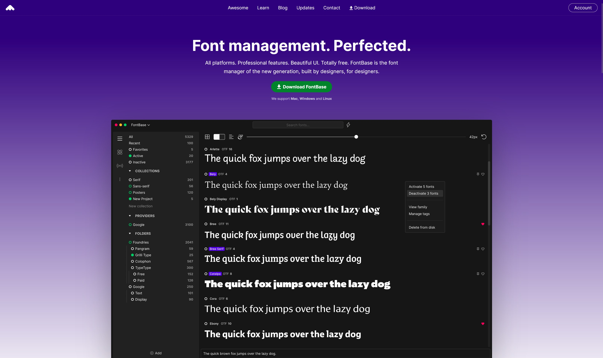
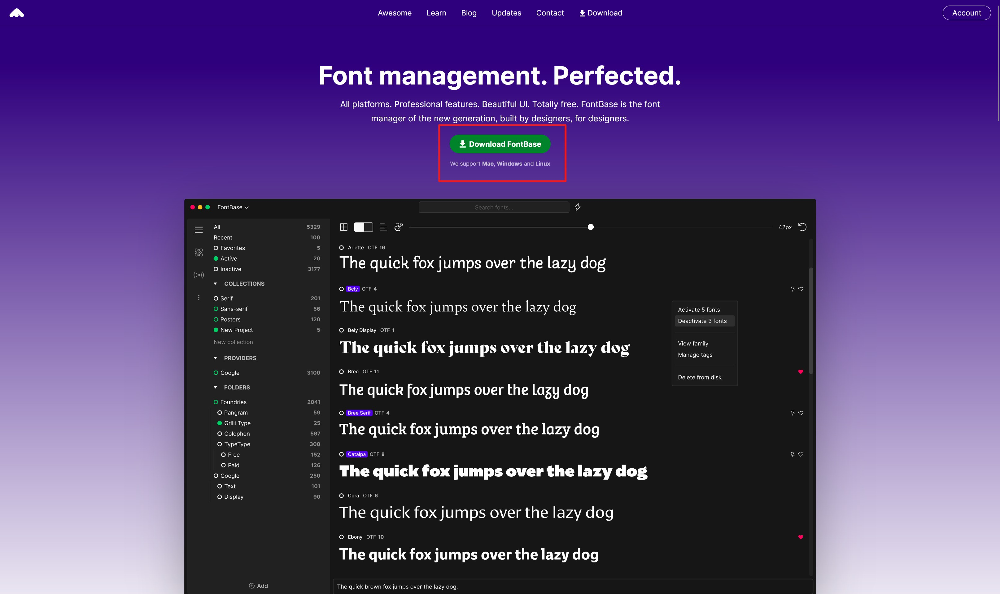
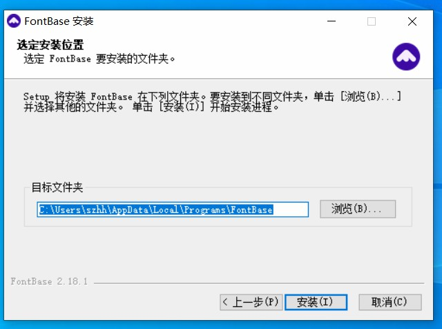
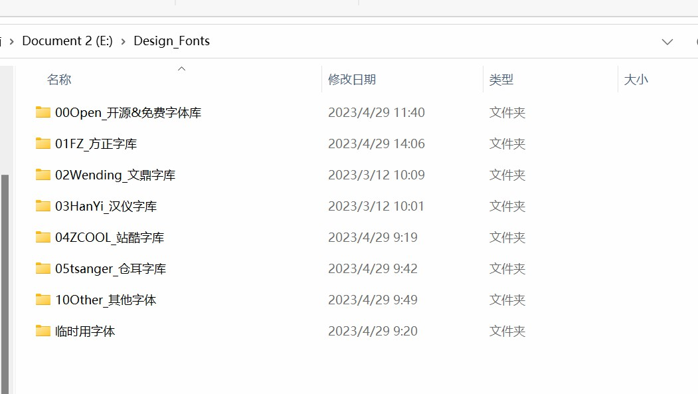
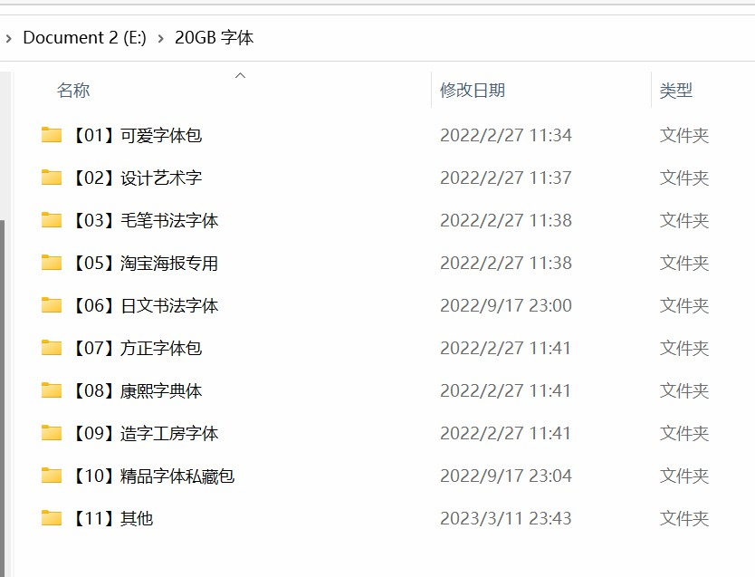
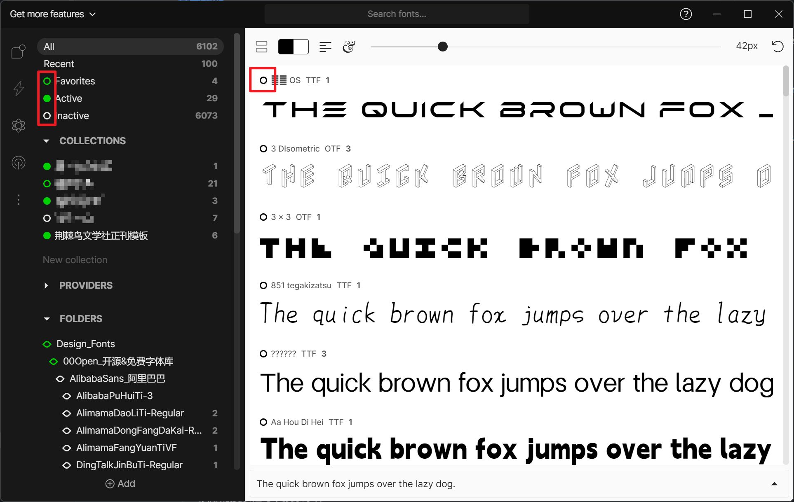
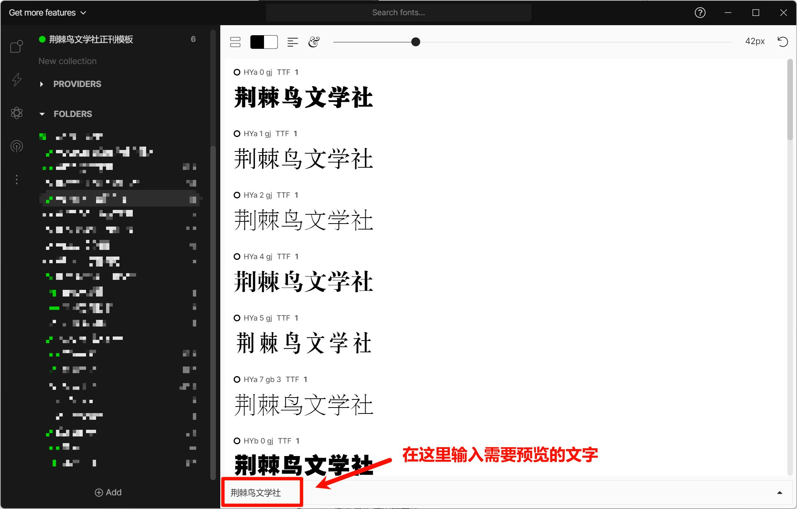
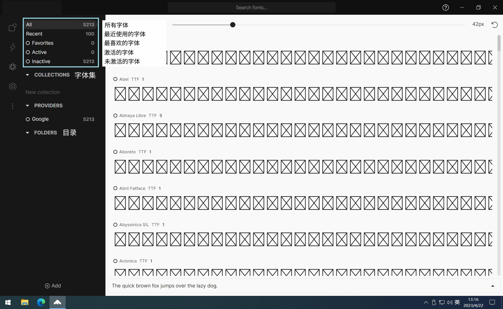
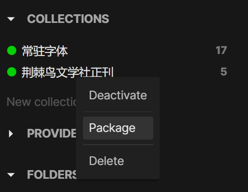

## 字体管理软件

### FontBase

特性：
- 免费部分功能完善
- 可以一键切换字体的激活/未激活状态
- 颜值高
- **能够打包所使用的字体**
- 可以自己对字体进行分类

存在的问题：
- 英文软件，上手有一定难度
- 需要有自己的本地字库
- 国外网站下载较慢

### 字由

特性：
- 丰富的云字库
- 可以一键切换字体的激活/未激活状态
- 国产软件易于国人使用

存在的问题：
- 必须登陆才能使用
- 字体无打包功能，不方便汇总传输

推荐使用 FontBase 软件进行本地字体管理，理由有如下几点：
- 该软件较其他软件更为成熟和完善，且界面美观
- 为数不多能够管理本地字体库的软件
- 能打包当前所用的字体
- 能手动对字体进行分类
- 能便捷地预览字体的效果
- 支持 Windows、Mac 和 Linux 平台

### Eagle
> 详见 [5.2 素材管理——Eagle](5.2.md#Eagle)

## FontBase 使用教程
### 设计理念
FontBase 不是一款用于安装和卸载字体的软件，而是一款用于全局字体管理的平台，它可以覆盖日常所有与字体相关的工作（不包括编辑字体）。
FontBase 最主要的思想是字体的激活和停用。当你在没有字体管理器的情况下使用字体时，字体通常被直接安装，如此一来字体文件便会被复制到你的系统字体文件夹中，并永远保存在那里。一段时间后，你的系统字体文件夹里就会有一大堆字体，这将导致整个系统性能下降和应用程序加载时间延长。
有了 FontBase，你可以简单地将字体添加到其中，并在你真正需要在设计项目或应用程序中使用它们时激活/停用它们。如此一来不需要的字体就不会占用你系统的任何资源。

### 下载和安装
> 目前 FontBase 最新版本为 2.21.0
::: warning FontBase 已经停止对 windows7 系统的支持
最后一个支持 windows7 的版本为 2.18.1，[官网下载地址](https://releases.fontba.se/win/FontBase-2.18.1.exe)
:::
1. 访问 [FontBase 官网](https://fontba.se/)，点击 **Download FontBase** 下载软件
2. 双击下载好的安装包进行安装
3. 打开 FontBase

### 添加本地字体库
第一次启动 FontBase 时，软件内不会显示任何字体。软件会提示你添加系统字体或者拖动一个包含字体的文件夹到软件中，以便开始使用 FontBase。
建议在本地硬盘上整理好自己的字体库，再使用 FontBase 进行管理和激活。

FontBase 软件有两种导入字体的逻辑：
- Copy（复制）：软件将需要添加的字体复制到软件的工作目录内，会实际占用工作目录的空间。
- Watch（监视）：软件不复制需要添加的字体，仅仅监视对应的文件夹，不会占用工作目录的空间。并且文件夹内有新的字体文件时，FontBase 会自动添加到软件中。

建议使用 **Watch** 模式添加字体：
1. 点击界面左下方的 **Add** 按钮
2. 选择 **Watched folder**，在弹出的窗口中选择需要监视的文件夹
3. 等待 FontBase 扫描完成即可

### 基本功能
#### 激活/取消激活字体
点击字体名称前的**小圆圈**即可激活该字体，再次点击即可取消激活。点击文件夹名称前的**小圆圈**可以激活该文件夹内所有的字体。

小圆圈有以下三种状态：
- 黑色中空：字体未激活
- 绿色中空：文件夹内有**部分**字体被激活
- 绿色实心：文件夹内的**所有**字体均被激活

#### 快捷预览字体效果
在软件的字体预览框下方的文本框内输入需要预览的文字即可预览效果

#### 其他功能

- 左侧窗口用于筛选字体。
    - All：查看软件内所有添加的字体
    - Recent：查看最近使用的字体
    - Favorites：查看添加了星标的字体
    - Active：查看当前在 FontBase 内被激活的字体
    - Inactive：查看当前在 FontBase 内没有被激活的字体
    - Collections：自定义字体集，可以用于字体的分类
    - Folders：按照添加到 FontBase 的目录筛选字体
- 右侧主窗口用于查看字体效果。
    - 顶部的滑动条可以更改预览的字体大小
    - 底部的文本框可以更改预览文字的内容
    - 顶部的搜索框可以搜索字体

### 字体打包
完成设计交稿时，我们需要将所用到的字体文件全部打包一起发送以便汇总，并且市面上绝大部分字体管理软件没有提供这样的打包功能。
以下为在 FontBase 中打包字体的步骤：
1. 在 **Collections** 中创建一个新的集合，名称任意。
2. 选中 **Active** 选项卡，在右侧的预览界面中按 **Ctrl+A** 全选已经激活的字体。
3. 将选中的字体拖入到刚才创建的集合中。
4. 在集合名称的上方右键点击打开菜单，选择 **Package** 选项
5. 选择需要保存的位置，点击保存即可。
FontBase 使用 zip 压缩文件打包字体，汇总时解压即可使用。

## 字体丢失的解决方法

收到美编成员的排版作品后，如果直接打开上交的作品会出现字体丢失的情况。接下来给出推荐的解决方法：

1. 将所有排版作品附带的字体文件复制到**同一个文件夹**内（该文件夹不建议放在可移动的存储介质中）
2. 根据 [FontBase 使用教程](#fontbase-使用教程) 安装 FontBase 软件
3. 将刚才含有所有字体的文件夹添加到 FontBase 的 Watched folder 中，并等待自动扫描完成
4. 直接激活所有目录内的字体后，打开 InDesign 查看效果即可