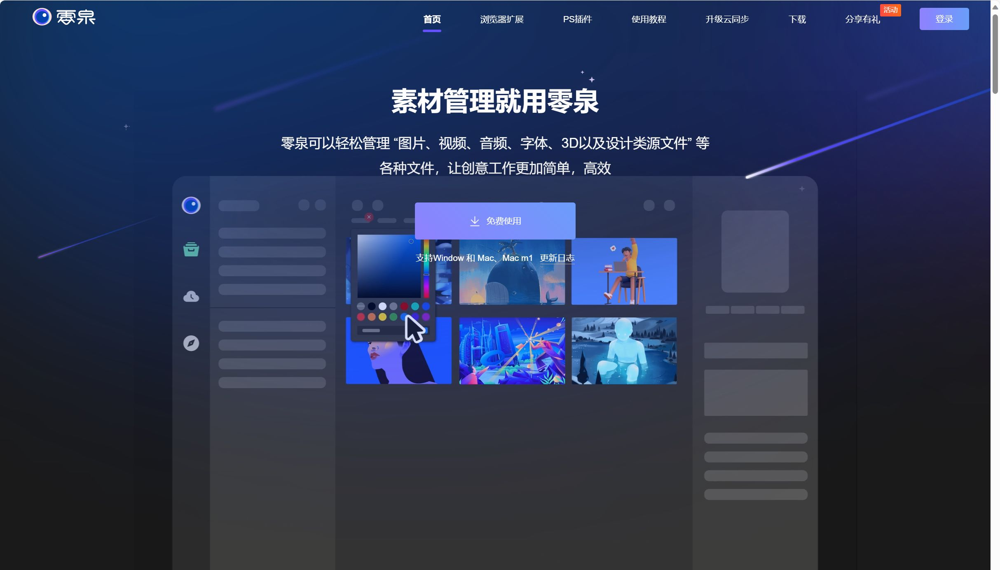
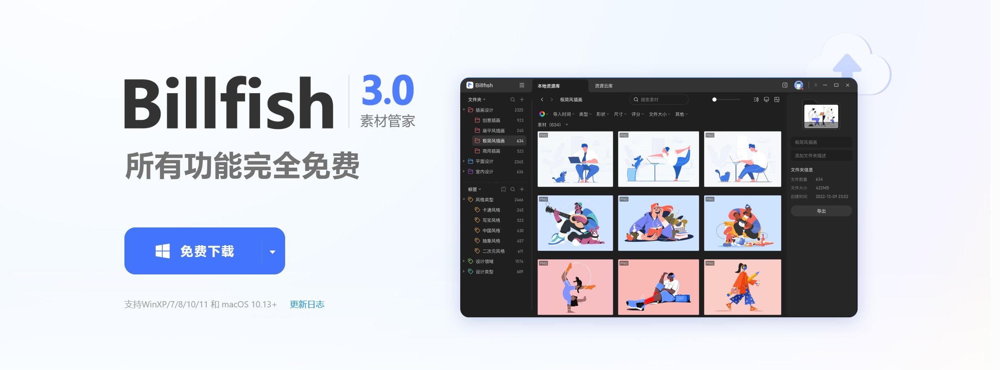
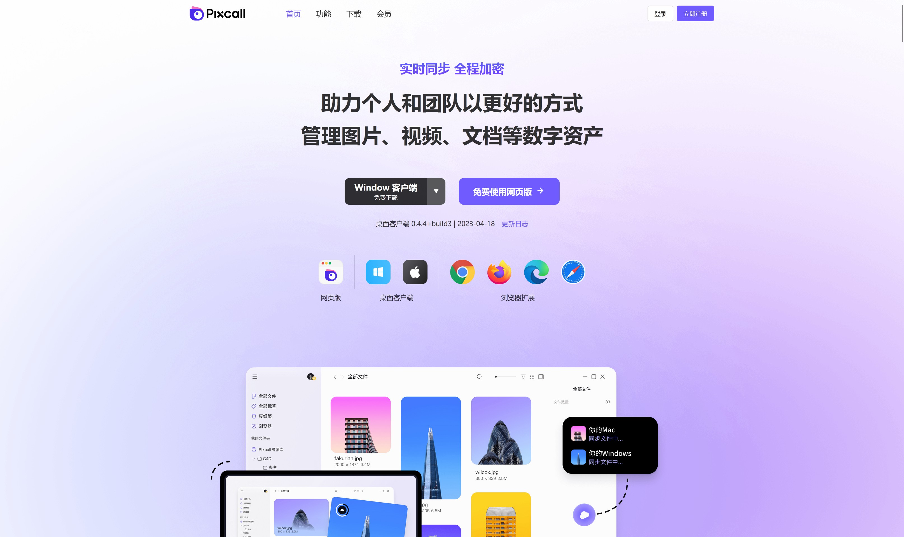
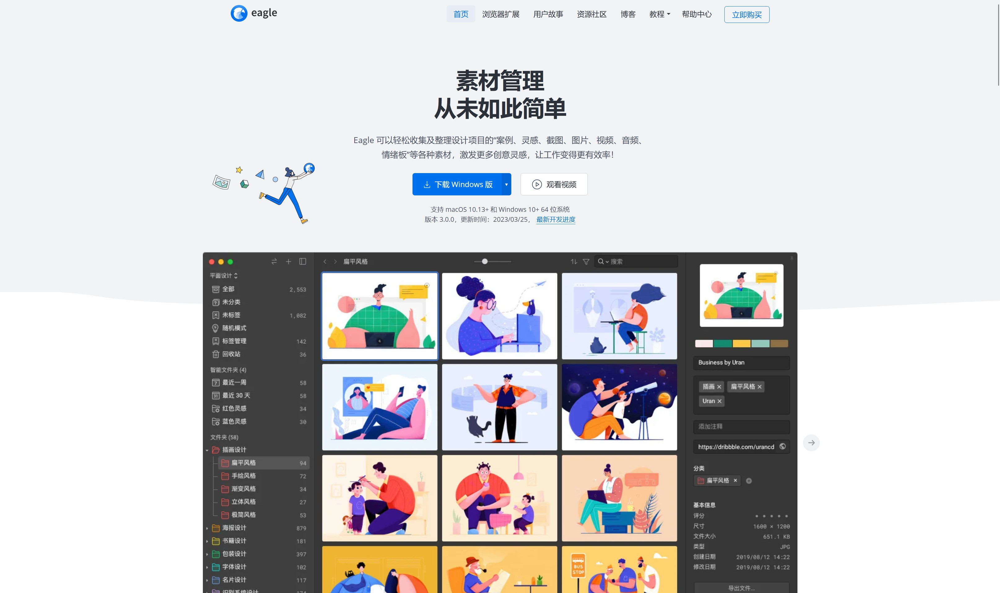

## 素材管理软件

### 零泉

一款免费的素材管理软件，带有付费的云同步功能
优点：
- 主要功能免费
- 浏览器插件可以一键拖拽收藏图片
- 可以通过标签、文件夹、标星等多种方式快速归类及筛选素材
- 软件内含有设计师网站导航
- 自动过滤重复文件
- 官方有相对详细的使用教程

存在的问题：
- 视频解码能力有限，无法解码部分特殊编码视频
- 无法读取 illustrator 源文件

### Billfish

一款免费的素材管理软件，带有付费的云同步功能
特性：
- 主要功能免费
- 能够加载绝大多数格式的素材
- 可以对素材进行标记方便后期查找
- 有浏览器插件可以收集网页中的设计灵感

存在的问题：
- 正在成长中的软件，在很多方面仍然有bug
- 部分文件格式无法正常读取
- 更新速度相对较慢

### Pixcall

特性：
- 注册赠送2G云存储空间
- 本地软件功能完全免费
- 软件较为稳定

### Eagle

综合性很强的素材收集、整理软件，可以管理案例、灵感、截图、图片、视频、音频、情绪板等各类素材

特性：
- 综合性很强的素材收集、整理软件，可以管理案例、灵感、截图、图片、视频、音频、情绪板等各类素材
- 支持几乎所有的素材类型
- 可以对素材进行标记方便后期查找
- 更新速度快且成熟

存在的问题：
- 收费（一份永久授权199人民币）
- 采用的数据库模式在数据量极大时，会产生极大的数据库文件，同时查询速度降低
