::: warning 美编部保留对作品的修改权利
为了保证整本刊物视觉一致性和其他原因，美编部保留对作品的修改权利。

即使是修改完成的作品，在汇总阶段也可能因为诸多原因被修改，因此最终成刊中的作品和我们提交的作品可能存在较大出入，请知悉。
:::

## 提交前检查
在提交作品前，我们需要对提交的作品进行检查。检查的目的是为了保证提交的文件符合规范，避免出现格式错误或排版错误等问题。

请仔细检查以下项目，无误后再将自己的作品进行打包发送：
- 是否正确使用了规范中的正文字体（注意检查**字重**和规范中的是否一致）
  - 正文字体的**字号、行间距**是否符合规范
- 图片是否遮挡页眉页脚

## InDesign 打包
InDesign 自带的**打包**功能可以帮助我们把 InDesign 源文件和使用的素材快捷地汇总到一个文件夹内。

1. 点击**文件->打包**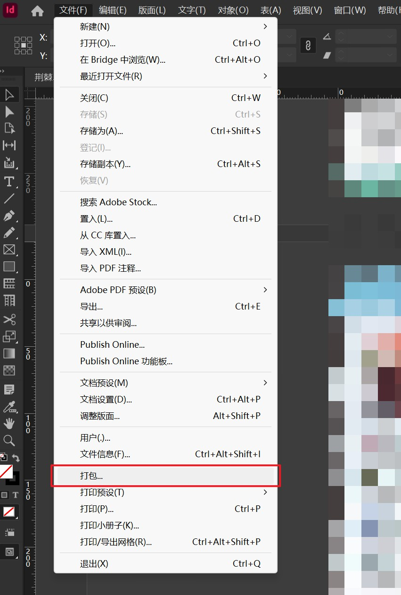
2. 在弹出的页面中点击**打包**按钮，选择需要保存的位置并调整保存选项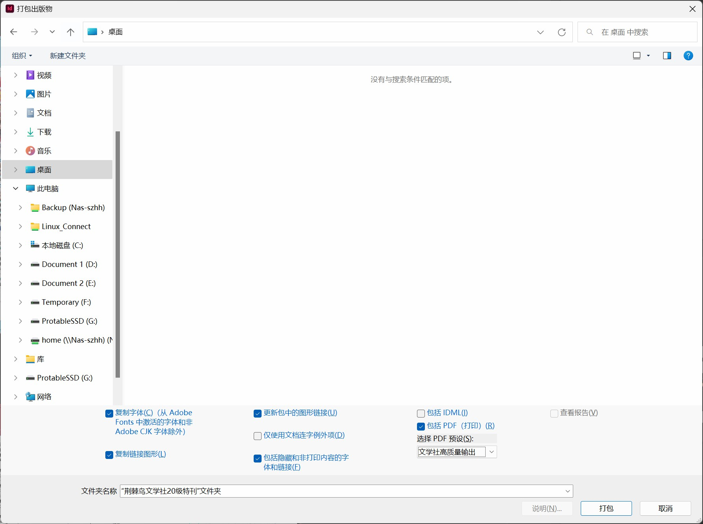
    下附部分选项注释：
    - 复制字体（可选）：保存小部分字体（需要手动打包使用到的字体）
    - 更新包中的图形链接（必选）：自动更新素材的链接至新的保存位置
    - 复制链接图形（必选）：复制已使用的图形素材
    - 包括 IDML（可选）：IDML 是一种可以兼容早期 InDesign 软件的格式，通常不需要勾选
    - 包括 PDF （可选）：保存一份 PDF 导出文件，建议开启
    - 选择 PDF 预设：建议选择**高质量打印**预设
3. 点击**打包**即可打包所有的素材和文件
4. **手动**将所有使用的字体放入打包生成的文件夹内（建议在打包文件夹内再新建一个文件夹专门用于存放使用到的字体）
5. 将文件夹压缩为压缩包后即可上交

::: tip 时间戳
压缩包命名时请附带**打包时的的日期**以便汇总人区分，如**压缩包名称_12.12**。
:::

## 字体打包
::: warning Indesign 的字体打包
Indesign 软件的打包功能**无法将绝大多数的字体自动打包**，需要遵循以下步骤手动打包使用到的字体。
:::

在将字体文件打包之前，我们需要知道使用了哪些非系统预装的字体（通俗地说就是你自己安装的字体）。在 Indesign 的**打包->字体**页面中，可以看到所有使用到的字体名称。其中如等线、宋体等均为系统自带的字体。

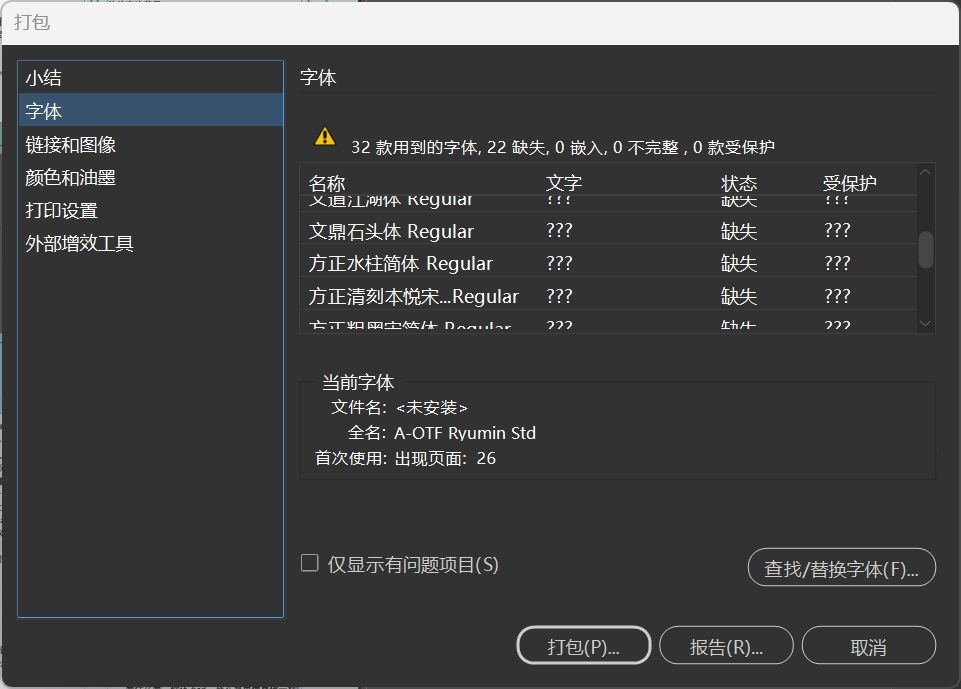

在了解了使用了哪些字体之后，我们需要找到相应的字体文件。这里可以分为以下几种情况：

### 在网络上下载了若干字体文件，并直接安装到系统内，且下载时的字体文件**没有被删除**
打开浏览器或下载工具的下载文件夹，直接将使用到的字体文件复制到 Indesign 输出的打包文件夹内。

### 在网络上下载了若干字体文件，并直接安装到系统内，但下载时的字体文件**已经被删除**
方法1
1. 重新下载使用到的字体文件
2. 将重新下载的字体文件复制到 Indesign 输出的打包文件夹内

方法2
1. 使用 [3.4 进阶操作/查找/替换字体](../ChapterNo3/3.4.md#查找字体) 打开字体所在位置
2. 将字体文件复制到 Indesign 输出的打包文件夹内

### 使用在线字体管理软件
如果使用在线字体管理软件，则无法将字体一同附在压缩包内上交。对于这种情况，请在上交时提供使用的**软件名称**和**使用的字体名称**给汇总人。

> 目前已知的在线字体管理软件：字由；以方·iFonts

::: tip 使用 FontBase 管理和打包字体更加便捷
详见 [5.1 字体管理](../ChapterNo5/5.1.md#fontbase-使用教程)一节中的 **FontBase 使用教程**。
:::

## 压缩软件
使用压缩软件可以将文件夹打包成**单文件**并减小体积，上交多个文件通常采用压缩包的方式。

::: danger 操作误区
避免**直接双击**打开压缩包内的文件并进行**编辑**，只可双击文件进行**预览**。
原因如下：压缩软件会在你双击文件时对该文件进行解压操作，并将解压出的文件存放在系统的**缓存目录**内。在你关闭文件后，压缩软件会删除该**缓存文件**，如此一来你的修改便会完全丢失。再然压缩软件通常只会解压你选择的一个文件进行缓存，其他的依赖文件不会被解压。如此一来打开 InDesign 源文件时便会出现**素材丢失**的情况。
:::

### 360 压缩
[360 压缩](https://yasuo.360.cn/index.html)是360推出的免费解**压缩**软件，360压缩快速轻巧、兼容性好、永久免费。**360 压缩**内置云安全引擎，可以检测木马，更安全。（摘自官网搜索引擎引导词）
#### 一键解压
1. 在文件资源管理器中双击打开一个压缩包或在文件上右键->打开方式-> **使用360压缩打开**
2. 点击上方菜单栏的**一键解压**按钮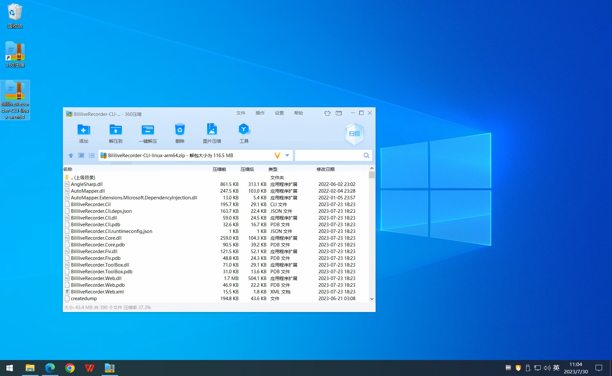
3. 360压缩会将当前压缩包内的文件解压到**压缩包所在目录/压缩包名称**内

::: tip
使用一键解压时可以开启**自动关闭360压缩**功能减少操作次数
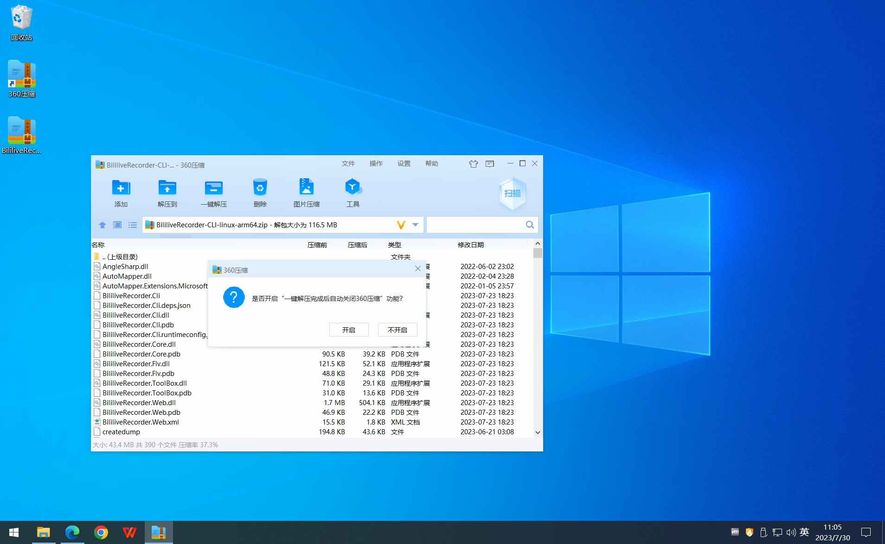
:::

#### 手动解压
1. 打开压缩包
2. 点击上方菜单栏的**解压到**按钮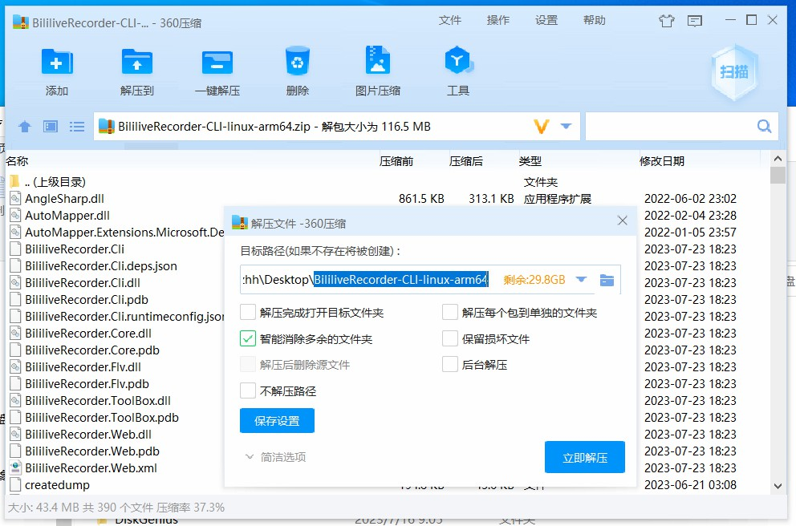
3. 调整解压位置和其他参数后点击**立即解压**即可

#### 压缩
1. 选中需要压缩的文件，右键选择**添加到压缩文件（A）**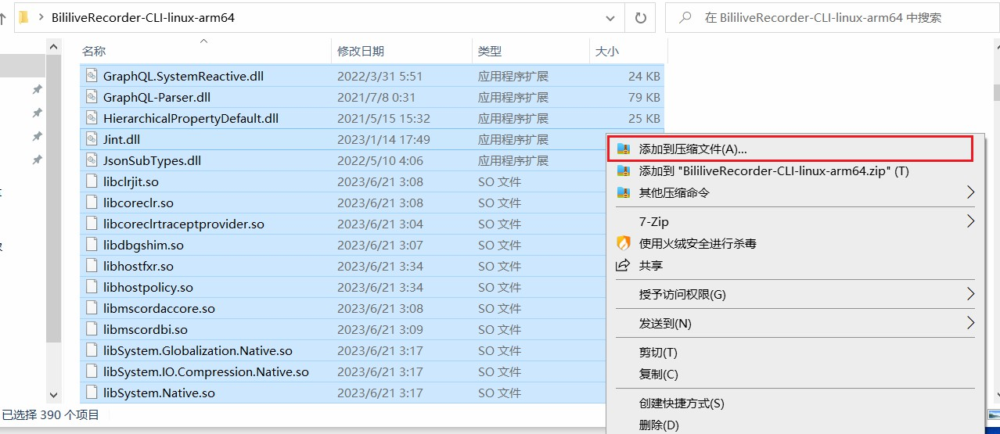
2. 选择压缩配置并点击立即压缩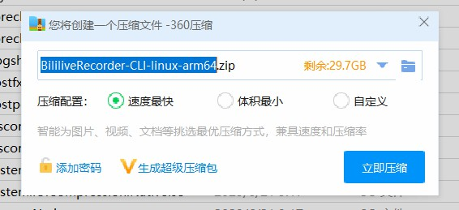

::: tip 提示
通常情况下选择**速度最快**即可。更小的压缩文件体积会需要花费更长的时间进行压缩，同时也需要更多的时间进行解压。
:::

### 7-Zip
[7-Zip](https://www.7-zip.org/) is free software with open source. The most of the code is under the GNU LGPL license. Some parts of the code are under the BSD 3-clause License. Also there is unRAR license restriction for some parts of the code. （摘录自官网介绍）
> 译文：7-Zip 是一款免费的开放源代码软件。绝大部分代码使用 `GNU LGPL` 许可证开源。部分代码使用`BSD 3-clause`许可证开源。此外，部分代码受到 `unRAR` 许可证的限制。

#### 关联压缩包格式
7-Zip 在安装完成后不会关联压缩包的各种格式，需要我们进行手动操作进行关联。
1. 打开 7-Zip 软件
2. 点击**菜单栏->工具->选项**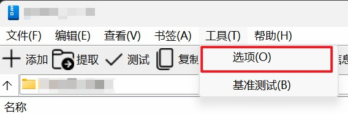
3. 点击需要关联的文件类型右侧的黄色区域将黄色框内的文字调整至显示**7-Zip**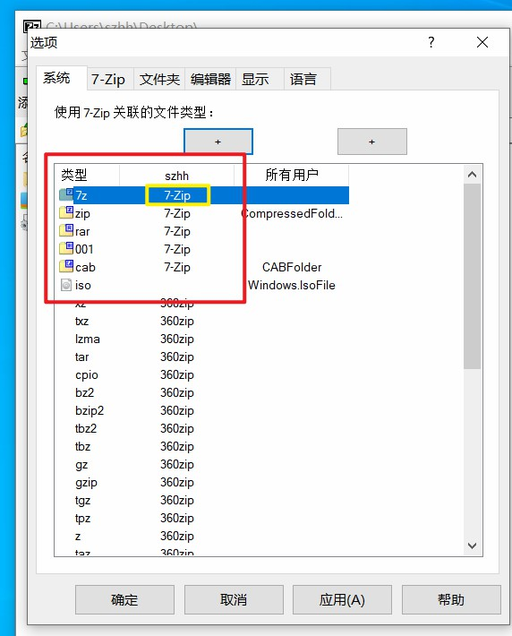
4. 点击对话框下方的**确定**即可完成文件关联设置
> 常见的压缩文件格式：`7z`、`zip`、`rar`、`tar`

#### 解压
1. 使用 7-Zip 打开需要解压的压缩包
2. 点击菜单栏上方的**提取**按钮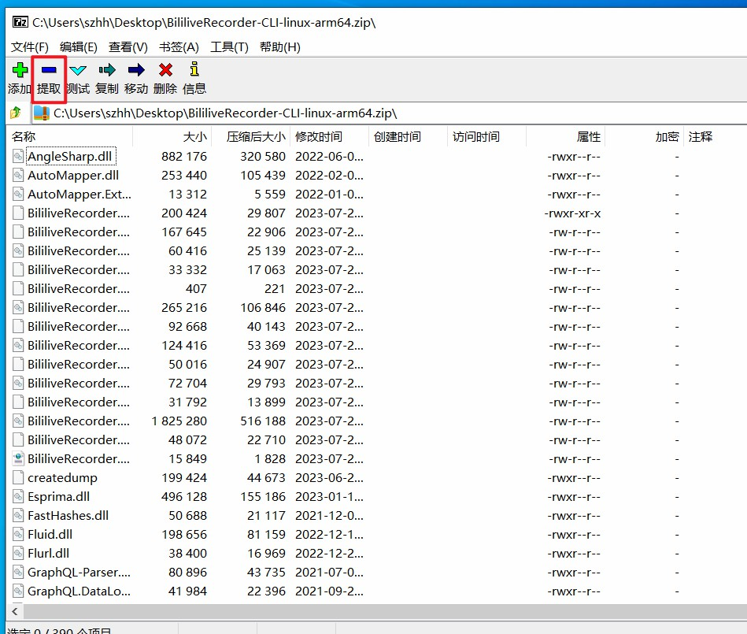
3. 选择需要解压到的位置并点击确定即可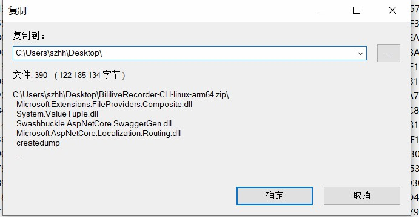

#### 压缩
1. 在文件资源管理器中选择需要压缩的文件并右键选择**添加到压缩包**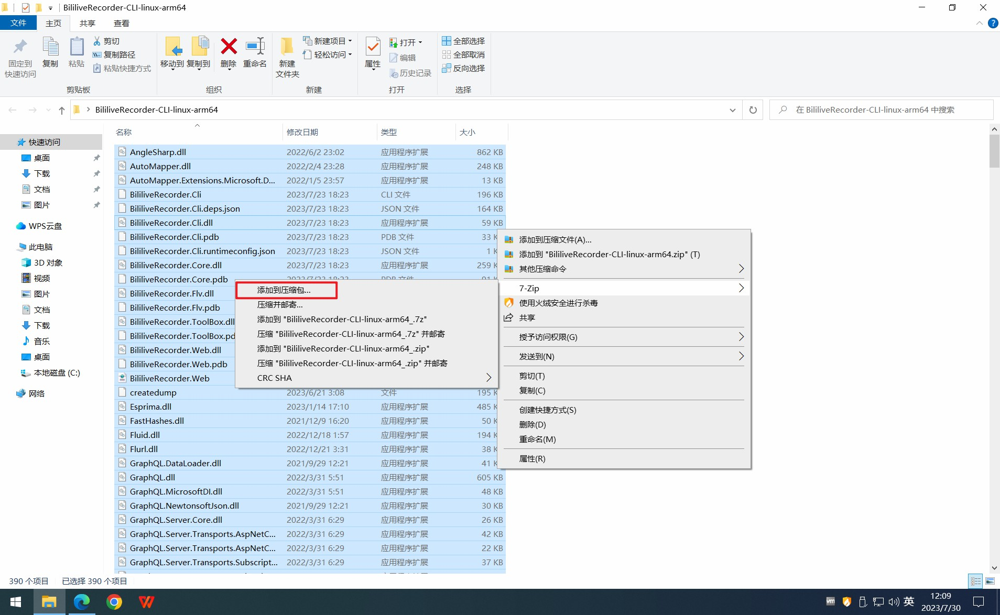
2. 调整压缩参数（通常仅调整**压缩格式**和**压缩等级**即可）并点击**确定**按钮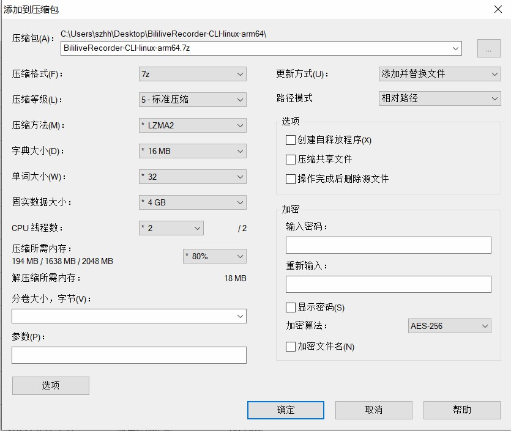
参数参考：
- 压缩格式：
	- 7z：通用的归档容器，默认采用 `LZMA2` 算法进行压缩
	- tar：常见于 `Linux` 的一种归档文件（无压缩功能）
	- wim：`Windows` 映像格式，用于存储 `Windows` 系统
	- zip（推荐）：通用的归档容器，默认采用 `Deflate` 算法进行压缩
- 压缩等级：等级越高需要花费的时间越长，对 CPU 的要求越高
- 压缩方法：
	- LZMA2：`LZMA` 的改良算法（推荐）
	- LZMA：一个基于 `Deflate` 和 `LZ777` 算法改良和优化的算法
	- PPMd：一种文本无损压缩算法
	- BZip2：基于 `Burrorws-Wheeler` 变换的无损压缩算法
- 字典大小：构建一个可被查询的字典，压缩时对照记录，以提高压缩效果，字典越大可以对比内容越多，压缩率就越高。
- 单词大小：英文原文为 *fast bytes*，提高该参数有**概率**可以提高压缩率。该参数越大，压缩速度越慢，但不影响解压速度。
- 固实数据大小：固实压缩文件中即将全部文件都当成一个连续数据流来看待，压缩/提取过程中都需要上下文信息，该参数决定了这个连续数据流的大小
- CPU 线程数：同时使用的 CPU 线程数，理论上数值越高压缩速度越快。
- 压缩所需内存：进行压缩操作时允许使用的最大内存百分比

### NanaZip

[NanaZip](https://apps.microsoft.com/store/detail/nanazip/) is an open source file archiver intended for the modern Windows experience, forked from the source code of well-known open source file archiver 7-Zip.（摘录自官方介绍）
> 参考译文：NanaZip 是一款为现代化 Windows 体验设计的开源文件压缩器，其源代码来自于著名的开源文件压缩器 7-Zip。  
> 译者注：简单来说就是为 7-Zip 写了一个界面让它更符合 Windows11 的设计。

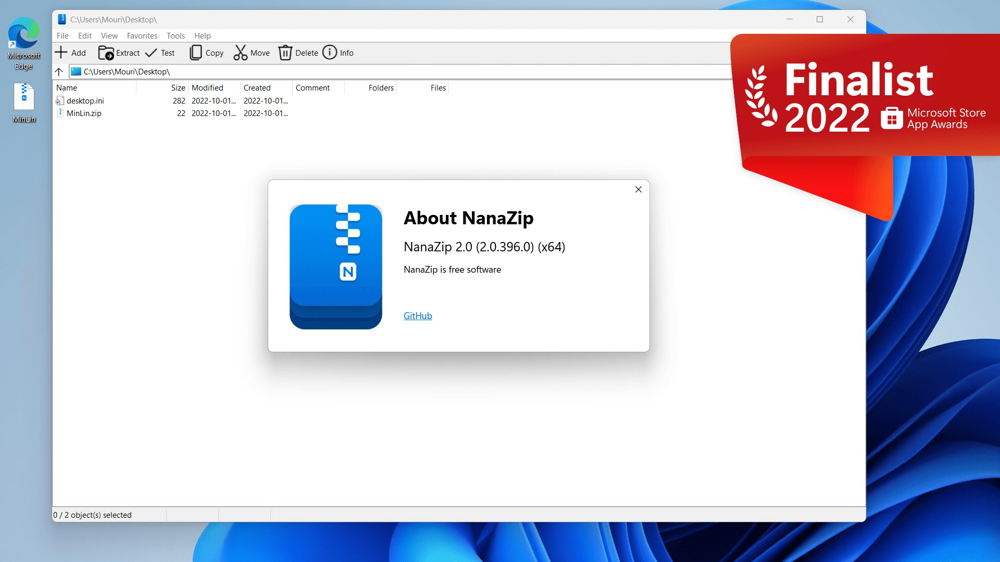
