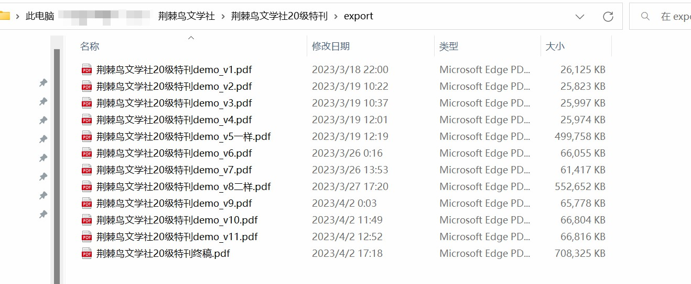
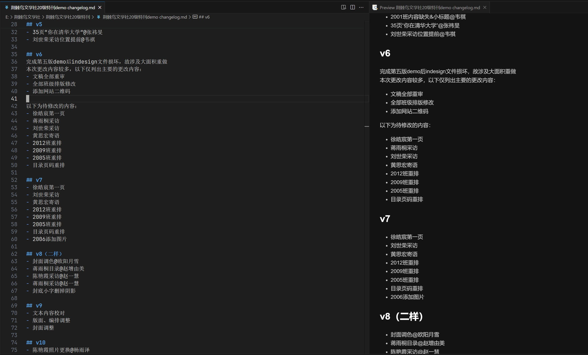

## 线上审稿
强烈建议对于在**线上**进行的*汇总稿*审查和修改附上**修改日志**，同时在上传的文件的名称中附带**版本号**  
下面给出一种参考：  
- 文件命名
- 修改日志
修改日志包含的要素：
- 版本号
- 修改内容（有提出人的应附上提出人ID）
- 待修改的内容（可选）

## 关于样刊
样刊到达后要及时分发，标注需要修改的地方。以下列出一些常见的检查事项：
- 检查刊物中是否存在**错别字**
- 检查刊物中是否存在**不符合规范的排版**
- 检查样刊是否存在较大**色差**
- 检查刊物是否存在**裁边**的问题

::: tip 关于样刊的质量
通常样刊使用的印刷设备和正式出刊使用的印刷设备相同，并且样刊的质量和正式印刷有一定的出入。同时样刊的装订方式和正式印刷也存在差异。

如果对刊物的质量有任何疑问，一定要及时联系厂家进行反馈！⚠
:::