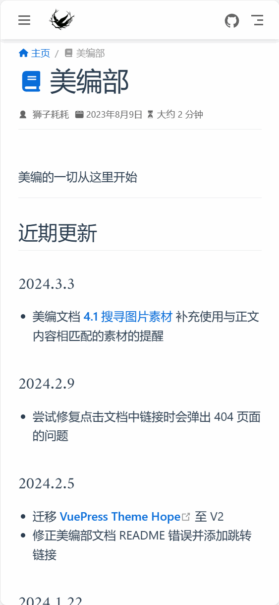
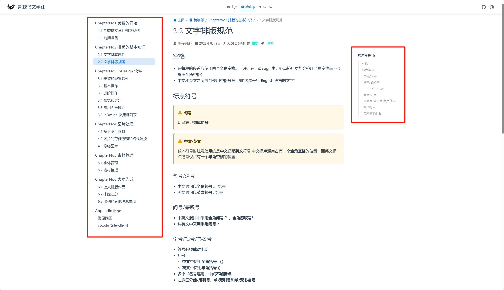

欢迎来到荆棘鸟文学社美编文档！🎉

美编的一切从这里开始。✨

::: info 版本声明
文档内容均基于 InDesign 2022 17.4 版本编写，不同版本间存在一定差异
:::

## 最近更新
### 2024.12.30
- [附录：常见问题](Appendix/question.md#出现解决此问题所需的-adobe-creative-cloud-丢失或损坏弹窗) -> 补充出现“解决此问题所需的 Adobe Creative Cloud 丢失或损坏”弹窗的解决方案

> [附录：历史更新日志](Appendix/changelog.md)

2024 年最后一次 Commit！🎉

从 2023 年 3 月份文档立项，到今年年底，整个文档已经有了上百次代码提交，总字数也来到了万字级别，中途还切换过两次开发框架。

或许你会想问：为什么要花如此多的时间来写这些文档呢？

建立文档的初衷是为了规范刊物制作的流程，统一刊物的长宽、边距和排版的版式。后面又慢慢加上了一些大家会在排版中遇到的问题和相应的解决方法，最后成为了现在这一份内容完善、阅读方便的文档。或许也没有多少人认认真真地看过文档里的每一个字，但是我在撰写的时候，还是需要仔细斟酌文档里的每一个用词，每一个版面，力求把文档的描述做到最准确、最易读。虽然这些工作都非常费事费力，但是只要它能够帮助到你，哪怕只是帮助你解决了一个小小的问题，我都觉得花费的时间是值得的。

希望这一份文档能够帮助到每一位荆棘鸟的小鸽子呀！

祝大家 2025 年新年快乐！🎇

## 内容指引
如果你是初次进行美编工作，我们推荐你先阅读 [1.2 美编全流程](ChapterNo1/1.2.md)。

倘若你已经是美编部一名成熟的~~小鸽子~~了，你可以在菜单栏中选择你想查看的章节进行阅读。

::: info 文学社公开资源
[附录：文学社公开资源](Appendix/resource.md)
:::

## 网站操作指南
### 手机端
- 点击左上角的按钮可以打开文档目录
- 点击目录中的标题可以跳转到对应的页面

### PC 端
- 左侧为文档目录，右侧为本页内容的导航，点击即可跳转到对应的页面或位置

## 项目维护
该文档已经在 Github 开源，目前由 @狮子耗耗 维护。

如果你有任何意见、评论以及建议，请通过邮件发送至邮箱 [szhhlionhao@qq.com](mailto:szhhlionhao@qq.com)，或通过 GitHub 的 Issues 页面进行反馈。