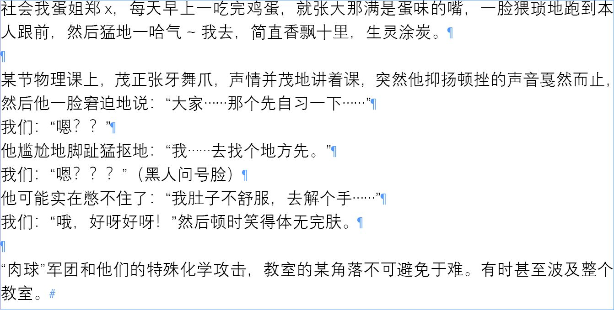

## 基本要求
- 尽可能保留原稿内容
- 按照本规范处理特殊内容如拼音、数学公式、表情等
- 使用纯文本编辑工具打稿（如记事本）

::: tip 难以辨认的字
难以辨认的字先**根据上下文**推断，确实无法推断出的使用**字形相近**的字替代
:::

## 通用规范
::: info 制作信息
本版规范参照 2021 级稿件制作
:::

::: warning 句号
切忌忘记**句尾句号**
:::

::: warning 全角/半角
输入字符时注意输入法**全/半角**状态
手机端输入时中文符号默认为全角，英文符号默认为半角
PC端输入法切换全/半角的快捷键通常为 `shift+space(空格)`，如果无法切换则需要到输入法设置中打开该快捷键功能
:::

::: warning 中文/英文
输入符号时注意使用的是**中文**还是**英文**符号
中文标点符号占有的位置比英文标点符号占有的位置**更宽**，可以根据这一点快速判断中/英文符号
:::

### 句号/逗号
- 中文语句以**全角句号 。** 结束
- 英文语句以**英文句号 .** 结束
- 逗号按照原稿输入，无逗号但上下文语义连贯的位置**补全逗号**
- 句尾漏写句号的**补全句号**

### 问号/感叹号
- 中英文混排中采用**全角问号 ？**、**全角感叹号！**
- 纯英文中采用**半角问号 ?**

### 引号/括号/书名号
- 符号必须**成对**出现，如果原稿漏写一边符号则根据**语义**补全
- 括号
    - **中文**中使用**全角括号 （）**
    - **英文**中使用**半角括号 ()**
- 多个书名号连用，中间**不加标点**
- 注意区分**前/后引号**、**单/双引号**和**单/双书名号**

### 冒号/分号
- 中文在提示语后引出下文内容必须使用**全角冒号：**
- 注意区分 **冒号：** 和 **分号；**

### 省略号/破折号/数字范围
**无论原稿如何书写**省略号/破折号/数字范围均按照下述方式处理

#### 省略号
- **中文**中采用**六点省略号 ……**
- **英文**中采用**三点省略号 ...**

#### 破折号/连字符
- **中文**中采用**两个全角破折号 ——**
- **英文**中
    - 连字符采用**单个半角破折号 -**
    - 破折号采用**单个全角破折号 —**

#### 数字范围
- **中文**采用 **波浪线 ~**
- **英文**采用 **单个半角破折号 -**

### 数学符号
::: danger 不可使用其他字符替代数学运算符
不可使用 **/** 替代 **÷**
不可使用 **x(小写字母x)** 替代 **×**
:::

::: tip 数学运算符
四则运算符可以在输入法的符号面板中找到，亦可以直接输入对应符号的中文后，在输入法的候选框中找到对应的运算符

:::

::: tip 数学公式
数学公式处理详见 [特殊符号处理：数学公式](#数学公式)
:::

- 加号：＋
- 减号：-
- 除号：÷
- 等于号：=

### 英文细节处理
::: warning 中英文混排
中英文之间输入一个**半角空格**作为间隔
中文标点与其后紧跟的英文之间**不需要**添加半角空格作为间隔
:::
- 英文**大小写**按照原稿输入
- 英文单句**句首字母大写**

### 日文细节处理
::: info 日文部分统一交给指定的编辑部成员输入
文稿中涉及日文部分统一交给指定的编辑部成员输入
:::
- 中日文之间**不使用**空格间隔

## 各版块规范
### 班级口号
- 标点符号按照原稿输入，句尾无句号的补全句号
- 换行按照原稿输入
- 段首不使用空格

### 班主任和科任老师寄语
- 标点符号按照原稿输入，句尾无句号的补全句号
- 段首不使用空格
- 每个班主任/科任老师的寄语**只成一段，不换行**
- 打稿格式
    - 班主任寄语：寄语内容
    - 学科全称+老师全名（如果没有全名的使用“姓+老师”代替）：寄语内容

### 班级趣事
::: danger 使用空行分隔
每一条趣事之间必须仅使用**一个空行**分隔
:::

- 每条趣事开头**不使用空格和任何形式的序号**，同一件趣事的多行开头同样不使用空格和任何形式的序号
- 句尾没有句号的**补全句号**
- 每一条趣事之间必须使用**空行**分隔，同一件趣事不需要用空行分隔

::: info 班级趣事打稿示例
>  符号表示*段落结尾*

:::

### 同学/老师语录
::: danger 使用空行分隔
每一条语录之间必须仅使用**一个空行**分隔
:::

- 每条语录开头**不使用空格和任何形式的序号**，同一条语录的多行开头同样不使用空格和任何形式的序号
- 将说话的人名**提到最前**（包括在结尾使用破折号引出说话人名），后接冒号和语录的内容，如：李老师：“你来！”
- 说话的内容使用**双引号**包围，原稿无双引号的补全双引号
- 句尾没有句号的**补全句号**
- 每一条语录之间必须使用**空行**分隔，多行语录不需要用空行分隔

::: info 同学/老师语录打稿示例
>  符号表示*段落结尾*

:::

## 特殊符号/文字处理

### 拼音的输入方式
- 拼音音调按照原稿输入
- 多个拼音连续使用时，将拼音输入到一个中文括号内并紧跟在对应的中文后，如：文档（wén dǎng）示例
- 拼音紧跟在其对应的中文后用**中文括号**包围，如：行（háng）
- 无对应中文的拼音同样使用**中文括号**包围，如：（háng）

#### 搜狗输入法（推荐）
1. 打开搜狗输入法菜单栏
2. 在菜单栏中选择**符号大全**
3. 在符号大全左侧菜单栏中选择**拼音/注音**
4. 点击对应的拼音注音即可输入

#### 微软输入法（windows10）
1. 在**中文输入状态**下输入 **uuzm** 打开注音输入模式
2. 按输入法的翻页键向下翻页即可找到拼音注音

1. 在**中文输入状态**下输入任意字符
2. 点击输入法待选框最右侧的符号按钮
3. 选择符号面板上方最右侧的 **Ω** 图标
4. 选择符号面板下方的 **α** 图标，向下翻动即可找到中文注音
5. 点击对应的拼音注音即可输入

#### 百度输入法
1. 右键输入法状态栏
2. 点击**工具箱->符号大全**
3. 在符号大全左侧菜单栏中选择**拼音/注音**
4. 点击对应的拼音注音即可输入

::: warning QQ输入法的拼音注音存在问题
QQ输入法符号面板中的拼音注音字符有部分为大写字母，无法正常使用
:::

#### 手机端
1. 点击需要输入的位置唤出手机输入法
2. 打开输入法的**符号面板**
3. 滑动菜单找到**拼音**
4. 点击相应的拼音即可输入

### 希腊字母
希腊字母使用输入法的符号面板输入即可，注意区分 w 和 ω
> 二十四个希腊字母对应的读音
> α 阿尔法， β 贝塔， γ 伽玛，δ 德尔塔， ε 伊普西隆， ζ 泽塔， η 伊塔， θ 西塔， ι 约塔， κ 卡帕， λ 兰姆达，μ 米欧 ，ν 纽， ξ 克西， ο 欧米克隆， π 派， ρ 柔 ，σ 西格玛， τ 陶 ，υ 玉普西隆， φ 弗爱， χ 凯， ψ 普赛

### 数学公式
::: tip 分数的处理
分数使用 **/** 作为分数线，分子在前、分母在后
如四分之六应输入为：6/4
:::

- 加减乘除（有理数范围内）按照原稿的表意和本规范的格式输入
    - 加法：1+1=2
    - 减法：2-1=1
    - 乘法：1×10=10
    - 除法：6÷4=3/2
- 其他运算如求和、积分和非有理数范围内的运算使用**自然语言描述**并用中文括号包围
    - $\sum^{n=1}_{n \to \infty}{\frac{1}{(2n-1)(2n+1)}}$ 可描述为：当n趋向正无穷时，对$(2n-1)(2n+1)$分之一从1开始进行求和
    - $\frac{\sqrt 5 - 1}{2}$ 可描述为：根号五减一的差除以二

### 表情/颜文字
打稿时仅输入以下几种符号，其他的表情/颜文字作忽略处理
- 心形
    - 空心心形：♡
    - 实心心形：♥
- 箭头：推出符号也按照单箭头处理，如⇒作为→输入
    - 左箭头：←
    - 右箭头：→
    - 上箭头：↑
    - 下箭头：↓